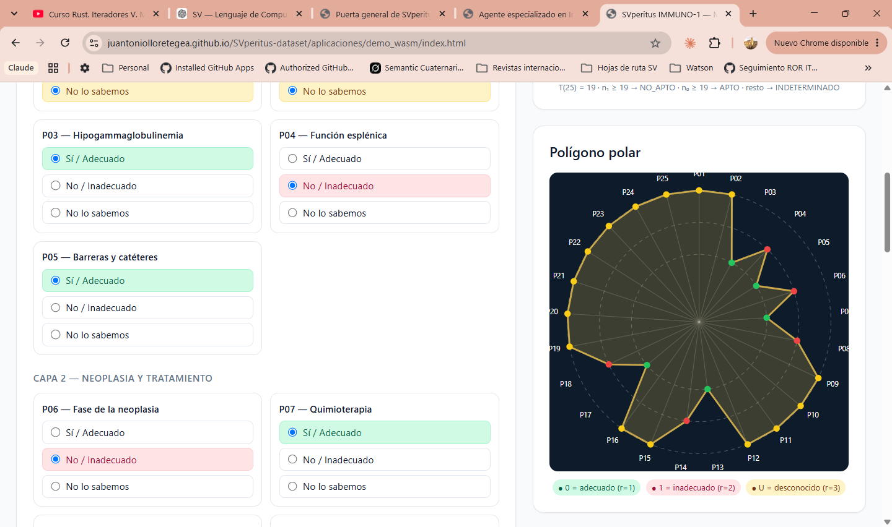
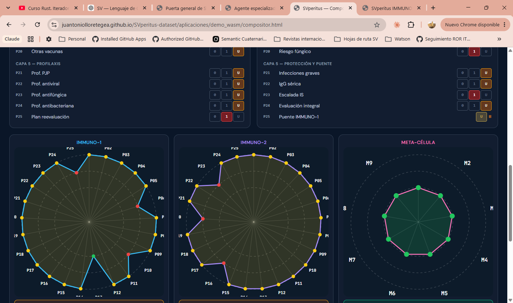
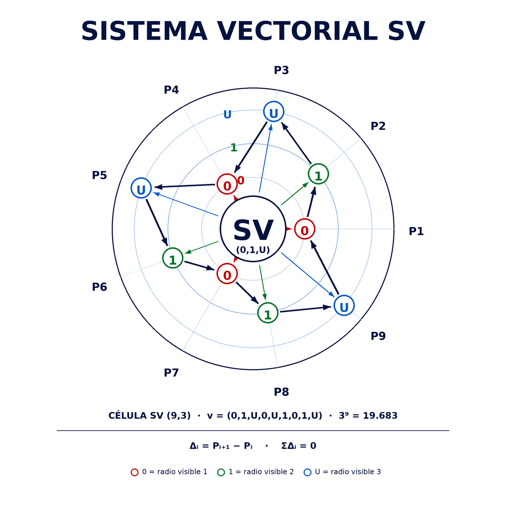

# Del volcán al encaje visual del SV

## Adenda: experto humano, agente especialista y representación matemática

**Autor de la explicación y director del proyecto:** Juan Antonio Lloret Egea.  
**Interlocutor y preparación editorial:** Watson.  
**Fecha:** 12 de septiembre de 2026.  
**Estatuto:** cierre de comprensión compartida del escenario y conformidad humana para su documentación y continuidad.

### 1. Qué completa esta adenda

La secuencia del volcán permitió explicar qué significa conservar, perder o sustituir información en una representación. Fue el primer paso para comprender el frame como una escena de conocimiento que un profesional puede examinar. Después, Juan Antonio aportó los polígonos de los antiguos cascarones IMMUNO-1 e IMMUNO-2 y el logo del Sistema Vectorial SV. Esas imágenes hicieron visible el encaje entre el experto humano, el agente especialista y la estructura computable que sustenta la presentación.

El experto y la IA pueden examinar **la misma representación visible y el mismo objeto de conocimiento**. El profesional encuentra una forma de lectura vinculada a su especialidad; la IA, dentro del alcance que tenga autorizado, puede además trabajar con la representación matemática y sus relaciones subyacentes. La presentación y el cálculo deben conservar su correspondencia.

El polígono no es un adorno añadido al resultado. Permite mostrar posiciones, estados y relaciones de forma que el humano pueda situarlos en el conocimiento de su dominio. Su significado depende de la constitución, de las etiquetas y de la leyenda que lo acompañan. La forma geométrica aislada no basta para interpretar una cuestión profesional.

### 2. Lo que aportó cada paso

| Paso de la explicación | Aportación al encaje |
| --- | --- |
| Volcán y transformaciones | Permiten reconocer pérdida de contexto y sustitución de rasgos decisivos para la fidelidad. |
| Polígono de IMMUNO-1 | Vincula una interfaz con parámetros de una especialidad y una representación posicional visible. |
| IMMUNO-1 e IMMUNO-2 | Muestran conjuntamente varios objetos y su composición en un antiguo cascarón. |
| Logo del SV | Reúne en una misma imagen posiciones, valores ternarios, vector escrito y cardinalidad. |
| Auditoría del trabajo | Conserva qué se consultó, transformó, ejecutó y entregó, con artefactos y resultados recuperables. |

La adenda incorpora tres imágenes originales sin modificación. La exposición es una síntesis editorial de las explicaciones del autor y de las imágenes disponibles; no reconstruye como citas literales respuestas antiguas que no se han recuperado.

<!-- pagebreak -->

## 3. Los polígonos de los antiguos cascarones

### 3.1. IMMUNO-1: parámetros y vista polar

La captura relaciona opciones de parámetros con posiciones del polígono. Su leyenda vincula `0` con adecuado, `1` con inadecuado y `U` con desconocido. Documenta una interfaz histórica; sus parámetros, umbrales y opciones visibles no se trasladan por esta adenda al dominio vigente.

<!-- pagebreak -->

### 3.2. IMMUNO-1, IMMUNO-2 y la vista conjunta

La segunda captura presenta dos polígonos de 25 posiciones y una tercera vista rotulada «META-CÉLULA». Hace tangible la lectura conjunta que Juan Antonio quería explicar. El rótulo y las relaciones del antiguo cascarón se conservan como antecedente visual; no constituyen una nueva célula, un nuevo agente ni reglas de composición para los dominios actuales.

<!-- pagebreak -->

## 4. El logo: una correspondencia visible y explícita

El logo muestra nueve posiciones, de P1 a P9, con el vector `v = (0, 1, U, 0, U, 1, 0, 1, U)`. La célula representada es `(9,3)`: aquí `b = 3`, `n = b² = 9` y el conjunto de estados posibles tiene cardinalidad `3⁹ = 19.683`.

La lectura de una posición se corresponde con un valor del vector escrito. La leyenda del logo asigna radios visibles 1, 2 y 3 a `0`, `1` y `U`, respectivamente. Los radios son una codificación gráfica: no convierten los símbolos ternarios en magnitudes clínicas.

Las flechas y las expresiones del pie forman parte del dibujo aportado. Su presencia no autoriza a deducir de ellas una ley de composición entre células de un dominio. El logo aclara la bisagra entre representación matemática y lectura visual sin sustituir el álgebra constituida.

<!-- pagebreak -->

## 5. La misma escena de conocimiento, dos formas de acceso

El experto reconoce los parámetros de su especialidad y examina su estado en una presentación inteligible. El agente especialista debe operar sobre la constitución que ha recibido, conservando el vínculo entre las posiciones, sus significados y las operaciones permitidas. La IA auxiliar puede ayudar a organizar, comparar y explicar ese material dentro de su autorización.

«La IA tiene las matemáticas por debajo» expresa este acceso complementario. La representación computable sustenta lo que ambos examinan. Para que la colaboración sea útil, la unidad asistente debe poder enlazar una observación visible con el dato y la regla que la respaldan, y explicar una transformación sin inventar las relaciones que faltan.

Comprobar que se conservaron espacios, valores y orden en un transporte es una pieza de ese trabajo. El encaje completo incluye también lo que ve el profesional y la correspondencia de esa presentación con el conocimiento representado.

### 5.1. Tamaño, posiciones y convenciones visuales

La célula canónica es un **vector plano, ordenado y posicional**, con `n = b²` y `b ≥ 3`. En el ejemplo de 25 posiciones, `b = 5`; en el logo de nueve posiciones, `b = 3`. La igualdad no convierte una célula en una matriz `b × b`. El SV no es un espacio vectorial. Estas distinciones se conservan al interpretar o implementar una vista.

Las leyendas de las capturas y del logo utilizan colores distintos:

| Símbolo | Cascarón IMMUNO-1 | Logo SV |
| --- | --- | --- |
| 0 | Verde; radio 1; «adecuado». | Rojo; radio visible 1. |
| 1 | Rojo; radio 2; «inadecuado». | Verde; radio visible 2. |
| U | Amarillo; radio 3; «desconocido». | Azul; radio visible 3. |

Por tanto, el color aislado no identifica de forma universal un estado ni su interpretación. Deben conservarse símbolo, posición, leyenda y significado recibido. Las imágenes originales se mantienen sin recolorearlas.

### 5.2. Relaciones entre células y reparto de funciones

Cada dominio constituye sus células y sus relaciones. Las composiciones de inmunología y las de ciberseguridad pueden exigir operaciones y secuencias diferentes. La analogía del autor con sumas, multiplicaciones o logaritmos ilustraba esa diversidad; no definía operadores nuevos.

Las leyes comunes ya constituidas pertenecen al alcance que el núcleo debe conocer y soportar. Determinar qué composiciones particulares quedan en el dominio y qué uso corresponde al agente debe respetar las actas y contratos aplicables. Mostrar dos polígonos juntos no resuelve automáticamente ese reparto. La auditabilidad permite examinar posteriormente qué se ejecutó sobre la constitución recibida.

<!-- pagebreak -->

## 6. Colaboración humana e IA

Juan Antonio sitúa la finalidad práctica en una colaboración sostenida: el humano aporta conocimiento, responsabilidad y autoridad; la IA ayuda a mantener accesibles el escenario, sus relaciones y el trabajo realizado. Una vez comprendido y documentado el encaje, la unidad asistente debe reducir la necesidad de que el autor vuelva a explicarlo en cada relevo.

Esto cobra valor cuando un profesional está fatigado, atraviesa un día difícil o afronta una carga elevada de trabajo. La ayuda puede consistir en ordenar la información, recuperar referencias, señalar discrepancias o presentar lo que falta por resolver. Esa asistencia debe permanecer ligada al conocimiento constituido y ser examinable por el humano responsable.

El esfuerzo inicial de diseño persigue facilitar la práctica posterior en medicina o en otros dominios. Su beneficio esperado forma parte de la finalidad del proyecto; la mejora efectiva de tiempos, carga de trabajo o resultados deberá valorarse en la realización correspondiente. La responsabilidad y la conformidad humanas no se transfieren por la claridad del dibujo ni por la fluidez de una explicación de la IA.

## 7. Rust como soporte de realización

La dirección técnica expresada por el autor es realizar el soporte computacional en Rust, con atención conjunta a seguridad y recursos. Su sistema de propiedad y préstamos permite detectar en compilación referencias colgantes y determinadas situaciones de acceso incompatible a memoria. Esta es una base concreta para reducir errores de memoria en código seguro. [The Rust Programming Language: References and Borrowing](https://doc.rust-lang.org/book/ch04-02-references-and-borrowing.html).

Las operaciones `unsafe` y las interfaces con componentes externos requieren que se respeten sus contratos de seguridad; no adquieren esas garantías por el mero hecho de invocarse desde Rust. [The Rust Programming Language: Unsafe Rust](https://doc.rust-lang.org/book/ch20-01-unsafe-rust.html).

Rust permite desarrollar software de sistemas eficiente sin necesitar un recolector de basura. Evitar referencias colgantes es una garantía de seguridad de memoria; no demuestra por sí mismo menor consumo o mayor velocidad que cualquier implementación en C o C++. La comparación exige medir el programa, sus estructuras, sus herramientas y su carga de trabajo. [Sitio oficial de Rust](https://rust-lang.org/).

La formulación técnica que se conserva es: **Rust ofrece un soporte sólido para seguridad de memoria y control de recursos; la eficiencia de la realización se acredita mediante mediciones**. Esta adenda no presenta las antiguas interfaces gráficas ni el LLM como software íntegramente escrito en Rust. La elección del soporte nuclear y la tecnología de presentación tienen alcances distintos.

<!-- pagebreak -->

## 8. Dos confirmaciones y un cierre compartido

### 8.1. Confirmación de Watson

**Confirmo que he entendido el encaje explicado por Juan Antonio:** el volcán muestra fidelidad y pérdida de significado; los polígonos históricos sitúan esa lectura en una especialidad; el logo hace explícita la correspondencia entre posiciones visibles y representación ternaria. El experto y el agente pueden compartir la referencia visual, mientras la IA dispone además del acceso autorizado a su representación computable. La documentación y la evidencia del trabajo permiten conservar y revisar ese vínculo.

Esta confirmación se formula al preparar la presente adenda. Queda respaldada por la explicación concreta anterior y no se presenta como una cita antigua recuperada.

### 8.2. Conformidad y luz verde de Juan Antonio

En su instrucción de incorporación, Juan Antonio declara el cierre compartido de esta explicación y ordena dejar constancia de ambas confirmaciones: **Watson lo entendió y Juan Antonio dio su conformidad y luz verde**. Autoriza añadir la adenda en PDF y Markdown y ordenar la lectura mediante un «Léame primero».

Se recibe esa conformidad como mandato humano expreso en esta conversación. Se refiere al escenario comprendido y a su consolidación documental. Las pruebas y cierres de la realización técnica continúan rigiéndose por sus expedientes y por la aceptación humana que les corresponda.

### 8.3. Secuencia que debe seguir la unidad entrante

1. Abrir el [Léame primero](LEAME_PRIMERO.md) de esta carpeta.
2. Leer el [expediente del volcán y del frame](FRAME_SIGNIFICADO_HUMANO_TRAZABILIDAD_Y_FIDELIDAD_2026_09_11.md).
3. Leer esta adenda y observar los polígonos históricos y el logo con sus leyendas.
4. Continuar con [Trazabilidad, auditoría y reproducción del trabajo de la IA](../trazabilidad-auditoria-y-reproduccion-del-trabajo-ia/README.md).
5. Consultar el [índice técnico vigente](../inicio.md) y el relevo aplicable antes de intervenir en la realización.

## 9. Procedencia y continuidad documental

La adenda se apoya en las instrucciones y explicaciones visibles de Juan Antonio, las tres imágenes aportadas, el expediente previo del frame y los Pilares del Lenguaje. No reproduce datos de pacientes ni convierte los antiguos cascarones en la constitución vigente de inmunología. Las consultas de contexto no recuperaron un diálogo literal adicional sobre las tres imágenes; por ello se ha utilizado una síntesis explícita, con la conformidad recibida en el mensaje actual.

Cortes cotejados: Lenguaje `82b311136e52a824c00c4fee3a67eaaafa94bb1e`; laboratorio `03b6af3c0f726686ee177243045eba1902a9f9b2`. Las rectoras ya leídas conservaban los mismos bytes. La base formal se mantiene en [Pilares y restricciones de diseño](https://github.com/juantoniolloretegea/SV-lenguaje-de-computacion/blob/82b311136e52a824c00c4fee3a67eaaafa94bb1e/docs/calidad/PILARES_Y_RESTRICCIONES_DE_DISENO_DEL_LENGUAJE_DE_COMPUTACION_SV_2026_09_05.md). Las referencias oficiales de Rust se consultaron el 12/09/2026.

El [manifiesto](MANIFIESTO.json) identifica la adenda y sus imágenes. Se conserva el expediente anterior del volcán; esta adenda completa su lectura y no reescribe aquel diálogo. El `Frame` formal, la traza del trabajo y la presentación humana mantienen sus distinciones.
