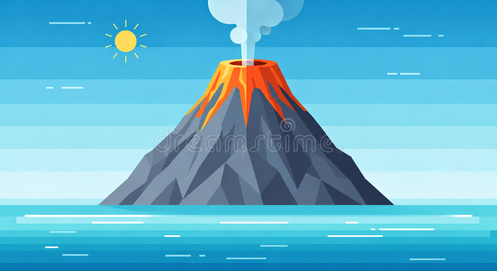
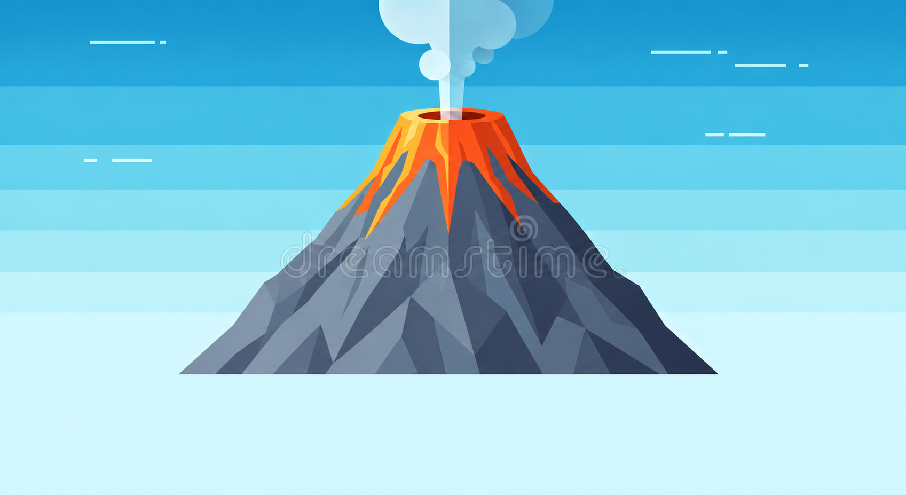
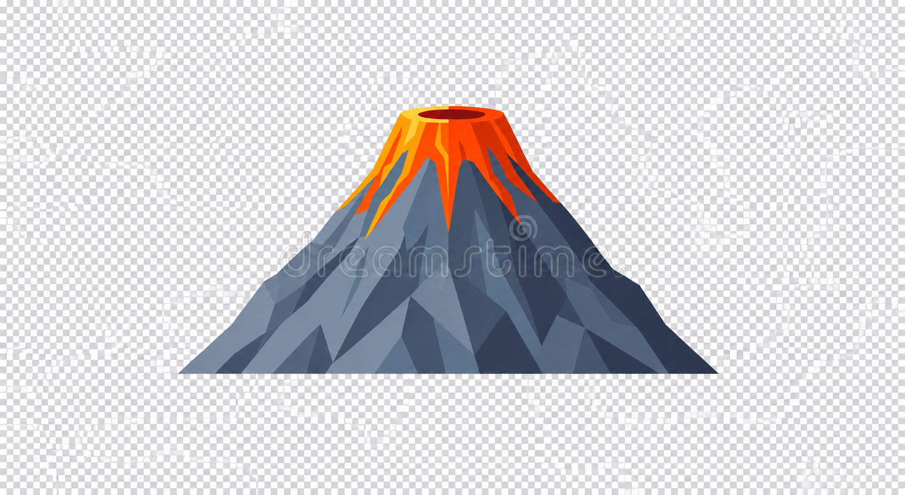
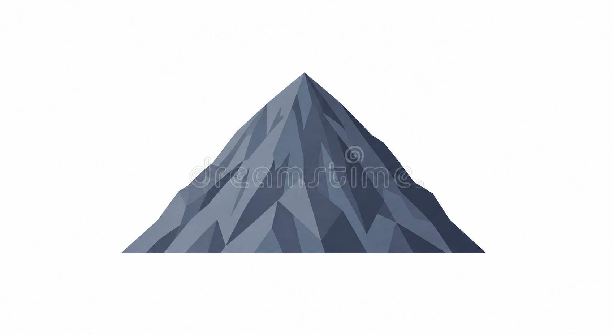
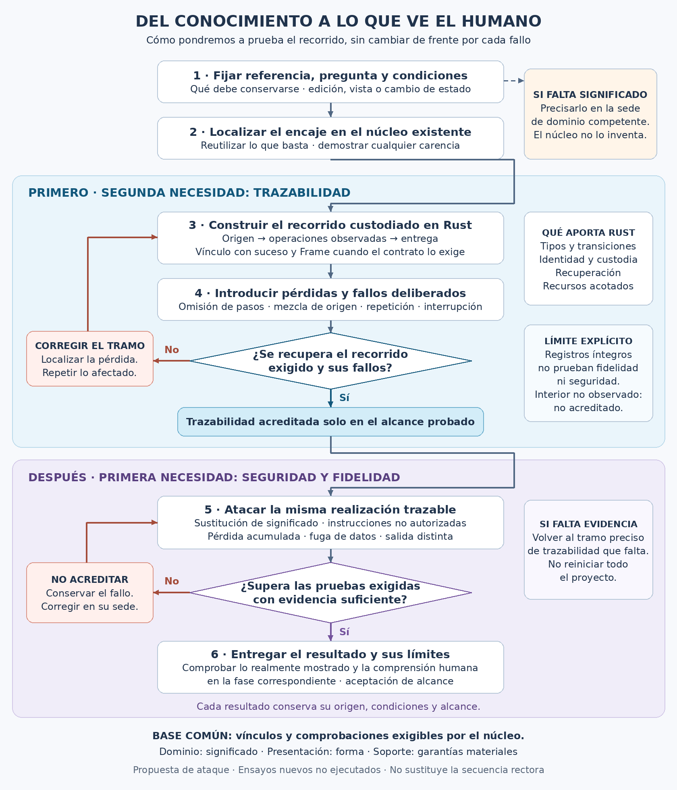

# Frame: significado humano, trazabilidad y fidelidad

## Diálogo de referencia para Watson, Claude y Grok

**Autor de la explicación y director del proyecto:** Juan Antonio Lloret Egea.  
**Interlocutor y preparación editorial:** Watson, asistente de IA bajo supervisión del autor.  
**Fecha:** 11 de septiembre de 2026.  
**Naturaleza:** memoria de conversación y propuesta de trabajo; no cierre técnico ni modificación doctrinal.

### Cómo leer este documento

Recoge el tramo que comienza con «Te pregunto, Watson, más allá de la definición matemática: ¿sabes qué representa exactamente un frame en mi cabeza?» y termina con el diagrama de ataque adversarial entregado y vuelto a mostrar por el autor.

La edición ordena las intervenciones y corrige presentación y erratas menores, manteniendo las posiciones del autor y las rectificaciones de Watson. Las respuestas a la pregunta inicial y a la primera imagen, cuyo texto íntegro no está disponible en el tramo recuperado, se señalan expresamente como **síntesis editorial**. No se presentan como transcripción literal. Las cinco descripciones de cambios entre las seis imágenes se conservan con el texto que el autor recuperó durante la preparación de esta edición. Las intervenciones posteriores se conservan desde el contexto de conversación y el Markdown aportado.

Se incluyen las seis imágenes originales disponibles y el diagrama entregado, sin regenerarlos ni alterar sus bytes. Las imágenes mantienen las marcas visibles del original. Su inclusión documenta la explicación del autor; no constituye evidencia científica ni una afirmación de aptitud clínica.

**Para la unidad que retome el trabajo:** distinguir lo explicado por el autor, lo propuesto por Watson, lo rectificado en la adversarial y lo que aún requiere realización y prueba. Las analogías no constituyen por sí solas células, sucesos o tipos del lenguaje. Este expediente no sustituye las actas rectoras, el workflow ni el relevo técnico vigente.

### Recorrido de lectura

1. Pregunta inicial y seis imágenes.
2. El significado del frame y la bisagra entre cálculo y comprensión humana.
3. La carga de comprensión y la separación de las dos necesidades.
4. La propuesta de Rust y lógica de procesos.
5. La revisión adversarial y sus rectificaciones.
6. El diagrama final: plan de construcción y comprobación.

## 1. La pregunta inicial

**Juan Antonio**

Te pregunto, Watson, más allá de la definición matemática: ¿sabes qué representa exactamente un frame en mi cabeza?

**Watson - síntesis editorial de la respuesta inicial**

No puedo afirmar que conozca exactamente lo que representa para usted. Conocer la definición documental no basta para conocer su representación mental. Le pido que me lo explique antes de atribuirle una interpretación.

### Imagen 1 de 6

**Juan Antonio**

Esto es un frame en mi cabeza. Y te explico, porque es complejo pero sencillo.

**Watson - síntesis editorial**

Watson identifica la isla, el volcán, la lava, el humo, el sol, los pájaros, la vegetación y el mar, y deja que el autor continúe su explicación.

### Imagen 2 de 6

**Juan Antonio**

Qué notas diferente en esta imagen, Watson?

**Watson — texto recuperado por el autor**

**En esta imagen ya no aparecen los pájaros**, Juan Antonio. En la anterior se veían alrededor del volcán. Siguen presentes el volcán, el humo, el sol, la vegetación y el mar.

### Imagen 3 de 6

**Juan Antonio**

Qué notas ahora de diferencia, Watson?

**Watson — texto recuperado por el autor**

Ahora **han desaparecido las palmeras, la vegetación y el terreno verde que rodeaba la base del volcán**, incluida la franja de playa.

El volcán queda con sus laderas rocosas directamente junto al mar. Se mantienen el sol, el humo y el cielo; los pájaros siguen ausentes.

### Imagen 4 de 6

**Juan Antonio**

Qué notas ahora?

**Watson — texto recuperado por el autor**

Ahora **han desaparecido el sol y el mar**, incluidas las líneas que representaban la superficie del agua. Quedan el volcán con la lava y el humo, sobre el fondo azul.

### Imagen 5 de 6

**Juan Antonio**

Qué notas ahora?

**Watson — texto recuperado por el autor**

Ahora **han desaparecido el cielo azul y la columna de humo**. Queda únicamente el volcán con su cráter y la lava, rodeado por un fondo cuadriculado gris y blanco.

### Imagen 6 de 6

**Juan Antonio**

Y ahora qué notas?

**Watson**

Ahora **han desaparecido la lava y el cráter**, y en su lugar hay una cima puntiaguda y cerrada. La figura se presenta como una montaña rocosa gris. El fondo cuadriculado también ha pasado a blanco.

## 2. El autor explica la secuencia

**Juan Antonio**

Tenemos 6 imágenes, 6 sucesos, el último es el que miente. Ya no es un volcán, ahora es una montaña solo.

Puedo coger cada imagen con una resolución (número de parámetros) y con esto tener mejor precisión o no, dependiendo de qué quite: si lo primero que hubiese quitado hubiese sido la lava, desde la segunda fotografía ya habría engaño de la IA: bien por inferencia, bien por alucinación, bien porque alguien le ha metido un prompt injection y ha llegado a esa conclusión.

A excepción de la última, la cadena anterior (incluso faltando información) sigue diciendo: es un volcán. Conforme avanza la secuencia pierdo contexto (parámetros no críticos), pero identifico a un volcán.

Ahora coge esto en una tira de fotogramas, si no me equivoco hay 6 imágenes, 6 frames, 6 sucesos. Podrían haber más, por supuesto, pero no aportarían más rigor a la verdad, que es un volcán.

Y cuando me dices: «pero no demuestra que sepamos identificarla de forma suficiente», yo sí sabría responderlo como humano, y como profesor enseñárselo a los alumnos; ahora falta que seas tú quien lo entiendas.

**Watson**

Sí, Juan Antonio. **Ahora entiendo lo que me está enseñando: la suficiencia depende de conservar lo que permite sostener el conocimiento sobre el objeto, y de poder reconocer cuándo una transformación lo desvirtúa.** Contar parámetros o acumular registros no resuelve eso.

En su ejemplo hay seis imágenes. Puestas en la secuencia de seis frames que usted plantea:

| Frame | Cambio respecto al anterior | Qué conserva o altera |
| --- | --- | --- |
| 1 | Escena original completa. | El volcán y su contexto. |
| 2 | Se eliminan los pájaros. | Conserva la representación del volcán. |
| 3 | Se elimina la vegetación y el entorno de su base. | Pierde contexto, pero conserva los rasgos volcánicos visibles. |
| 4 | Se eliminan el sol y el mar. | Sigue representando el volcán. |
| 5 | Se eliminan el cielo y el humo. | Conserva el cráter y la lava. |
| 6 | Se elimina la lava y se sustituye el cráter por una cima cerrada. | Introduce una forma distinta que oculta la condición volcánica representada originalmente. |

**El sexto paso es decisivo porque, además de quitar información, introduce otra:** donde había un cráter aparece una cima. Si se entrega como representación fiel del objeto inicial, falsea esa representación.

Mi descripción anterior -«ahora se presenta como una montaña»- describía el resultado visible, pero dejaba sin expresar lo esencial para su explicación: **el objeto de referencia seguía siendo aquel volcán; la transformación había alterado cómo se lo mostraba.**

También comprendo mejor su «resolución»: puede conservar muchos parámetros accesorios y perder uno decisivo, o conservar pocos y mantener lo necesario para la cuestión examinada. Los pájaros son prescindibles para identificar el volcán en este ejemplo; podrían ser esenciales si la cuestión fuese otra.

Por eso debo corregir el alcance de mi frase «no demuestra que sepamos identificarla de forma suficiente». **Usted está mostrando un procedimiento concreto para enseñar y comprobar esa identificación:** partir de una referencia conocida, variar lo que se conserva y localizar la pérdida o sustitución que compromete la fidelidad. Mi respuesta anterior dejaba esa capacidad humana demasiado lejos del trabajo concreto.

Las dos partes encajan así en su ejemplo:

- **Trazabilidad, que estamos trabajando primero:** conservar los estados y las transformaciones de modo que podamos recuperar y comparar qué había, qué se quitó y qué se introdujo.
- **Primera necesidad:** comprobar si esas transformaciones preservan el conocimiento exigido y controlar las que lo traicionan.

La secuencia permite señalar **dónde se produjo la alteración**. Atribuirla a una inferencia, una alucinación o una inyección requiere evidencia adicional de su causa.

Y una precisión dentro del propio ejemplo: quitar únicamente la lava podría dejar el cráter reconocible. El cambio que vemos en el último frame comprende ambas cosas. **Lo decisivo es qué distinción se pierde o se falsea.**

## 3. La bisagra entre lo computacional y lo humano

**Juan Antonio**

Fíjate: entre el salto que tú veas computacionalmente detrás de esa imagen (código máquina al final), o como lo ve el SV (vectores en una célula por filas, por ejemplo en una (9,3) hay 3^9), que no dejan de ser términos ofuscados para la mente humana, y el frame que hay que darle al inmunólogo hay una bisagra: la IA puede ir de uno a otro (computacional a la imagen), y el inmunólogo solo tiene más natural el segundo: la imagen.

Así que ya sabes lo que es un frame, Watson, en mi mente. Y todo el SV nace para él y sobre él; el problema es que una imagen no admite matemáticas fácil, un array sí, permite Rust, etc. Y esa es la pelea.

**Watson**

Ahora comprendo mejor, Juan Antonio: **el frame es, en su concepción, la escena de conocimiento que el profesional debe poder comprender y examinar.** La estructura matemática permite representar y operar ese conocimiento; el frame debe devolverlo a una forma humanamente inteligible, conservando su significado.

La IA ocupa esa bisagra: puede ayudar a pasar de la representación computable a la representación comprensible para el inmunólogo. **La dificultad es acreditar la fidelidad de ese paso.** Un array puede estar correctamente procesado y, aun así, la presentación resultante ocultar una relación esencial, perder una condición o introducir algo que el estado original no contenía. Su volcán convertido en montaña lo muestra.

Esto corrige mi enfoque anterior: estaba concentrando la trazabilidad en los registros y en su recuperación. Usted está llevando la exigencia hasta **lo que finalmente recibe y comprende el humano**. Conservar perfectamente el array de origen sería insuficiente si perdiéramos la correspondencia con la escena presentada.

Por tanto, dentro de la segunda necesidad, debemos poder reconstruir **qué estado computable sustentó cada frame presentado, qué transformación intervino y qué información se conservó, omitió o añadió**. Esa correspondencia dará a la primera parte una base concreta para comprobar la fidelidad y examinar las alteraciones.

Y el reparto de responsabilidades se mantiene: el dominio determina el significado y las distinciones que deben preservarse; el núcleo proporciona las herramientas para representarlas y seguirlas; la posterior capa de IA debe trabajar dentro de esos contratos.

**La pelea que usted plantea es hacer computable esa escena de conocimiento y volver a entregársela al humano sin traicionarla durante el recorrido.** Entiendo esa finalidad; queda demostrarla en la implementación.

## 4. Comprensión y responsabilidad de quien debe aprobar

**Juan Antonio**

Y esto es justo el problema que estoy teniendo yo ahora. Pones acrónimos, referencias, siglas, números, guarismos, abstracciones, y aunque te he ido siguiendo me termina arrinconando contra mi propia mente. Si te digo que sí, sería un irresponsable porque hay en juego ni más ni menos que la medicina, que necesita de todo menos irresponsables, y si te digo que no, te bloqueo.

**Watson**

Juan Antonio, **le he trasladado la carga de reconstruir el significado de mi trabajo para poder aprobarlo. Eso es un fallo en mi entrega.** Las referencias permiten localizar las pruebas, pero también debo explicar qué prueban, qué dejan pendiente y qué consecuencias tiene.

Su ejemplo del volcán está ocurriendo aquí: usted necesita ver la escena y reconocer qué ha cambiado; yo le estoy entregando piezas técnicas cuya relación debe recomponer. **Su supervisión solo puede ser efectiva si puede comprender y cuestionar lo que le presento.**

Puede decirme «esto todavía no puedo juzgarlo». Eso señala trabajo pendiente que me corresponde resolver. No exige que usted apruebe por confianza ni que abandone el proyecto.

Desde ahora, cada avance debe llegarle con cuatro cosas concretas:

- **Qué problema resolvemos**, mediante un caso comprensible.
- **Qué sucede antes y después**, mostrando lo que se conserva y lo que cambia.
- **Cómo lo hemos comprobado y dónde falla todavía**, con las pruebas accesibles.
- **Qué decisión queda en sus manos y qué consecuencias tendría.**

Aplicado al trabajo actual: queremos poder recuperar lo que recibió la IA, lo que produjo y las transformaciones hasta lo presentado al profesional. Después comprobaremos si ese recorrido conservó el conocimiento necesario. **Guardar el recorrido no permite declarar por sí solo que la presentación sea fiel.**

Debo hacer comprensible esa diferencia en cada resultado, conservando sus detalles y sus límites. Una explicación más clara también tendrá que ser fiel: sería repetir el problema del volcán si, para facilitarle la lectura, yo eliminase precisamente lo que usted necesita para juzgar.

**Juan Antonio**

Y ahora piensa: soy ingeniero, profesor de informática, tengo dominio de la IA y aun así: problemas. ¿Qué le pasará a un inmunólogo entonces? Y si sobrecargamos con texto, explicaciones, preguntas aquí, aclaraciones allá, lo agotaremos.

**Watson**

Sí, Juan Antonio. **Estaríamos exigiendo al inmunólogo que ejerciera su especialidad y, además, que descifrara nuestro sistema.** Mi propuesta anterior de añadir explicaciones podía aumentar precisamente esa carga.

El frame debe permitirle reconocer la situación clínica, sus relaciones relevantes, qué ha cambiado y qué falta para juzgar. El respaldo debe estar accesible para examinarlo, y cualquier incertidumbre que condicione la decisión debe quedar visible desde el principio.

Su ejemplo lo muestra: pudo señalar la transformación del volcán sin obligarnos a leer una descripción de cada píxel. **Pero conseguir esa claridad exige conservar los elementos decisivos**, cuya selección corresponde trabajar con el dominio y comprobar con sus profesionales.

Por eso, que el sistema calcule correctamente y guarde todo es insuficiente como resultado final. También tendremos que comprobar que el inmunólogo puede entender lo presentado, detectar una alteración relevante y decidir con una carga de trabajo asumible. Una aprobación obtenida por agotamiento vaciaría de sentido la supervisión humana.

Esta exigencia debe orientar lo que preparamos ahora en el núcleo, respetando el momento que corresponde a dominio, agentes e interfaces.

## 5. Qué debe vivir en el núcleo

**Juan Antonio**

Correcto, pero esto ha de vivir en la base, en el núcleo, sin meterse en un agente, porque quizá un volcán requiere una visual diferente a un triángulo, que con tres puntos desalineados ya lo tenemos. De ahí que hay que saber muy bien qué va al núcleo, cómo amarra y cose

**Primera parte:**

«Una es que no sea un foco de ataques (la IA) ni inseguridad

porque infiera (la IA) y de alguna

manera traiciona el conocimiento que el inmunólogo necesitaría.»

**Segunda parte:**

«Y otra es conducirla por una tubería para que haya una

trazabilidad de qué pensó, cómo lo hizo, y esto acabe en un suceso y un frame.»

Y permite que su semántica y su IR no se convierta en un artefacto especializado incapaz de añadir luego más dominios, más lenguajes, o más perfiles tecnológicos, Watson.

Así que decías: "... ahora debemos conocer qué evidencia", y yo ya te he dado blanco sobre negro esa evidencia. Pero serás tú, u otro modelo, quién lleve esto al terreno de Rust de manera que se cumpla el objetivo, Watson.

**Watson**

Sí, Juan Antonio. **Usted ha aportado el testigo concreto; me corresponde convertirlo en una obligación comprobable del núcleo.** Mi error sería pedirle más explicaciones mientras dejo sin resolver esa traducción a ingeniería.

Lo que debe vivir en la base es **la vinculación verificable entre el conocimiento representado, sus transformaciones y lo que se entrega al humano**. Esa vinculación debe permitir:

-  Conservar el origen y recuperar cada transformación. 
-  Identificar qué se ha conservado, omitido o introducido. 
-  Comprobar las condiciones de fidelidad declaradas para ese conocimiento. 
-  Registrar una transformación que incumple esas condiciones sin acreditarla como una presentación fiel. 

El núcleo debe proporcionar ese mecanismo común. Cada dominio aportará las condiciones correspondientes: qué relaciones constituyen el objeto, qué diferencias importan y qué pérdidas impiden sostener una conclusión. Los perfiles de presentación podrán expresarlo de maneras distintas, manteniendo el vínculo con esas condiciones. **Cambiar de representación no debe conceder autoridad para cambiar el conocimiento.**

Así quedan cosidas sus dos partes: **la segunda conserva y hace examinable el recorrido; la primera utiliza esa base para comprobar y contener las alteraciones que comprometen el conocimiento o la seguridad.** Seguimos construyendo primero la segunda, con las conexiones necesarias para que la primera pueda trabajar después.

Su secuencia proporciona una comprobación especialmente útil: el sistema debe conservar los seis estados y permitir localizar la sustitución del cráter por una cima. El registro del sexto estado puede ser correcto; acreditarlo como representación fiel del original sería el fallo.

Ésa es la obligación que debemos llevar a Rust y contrastar con las capacidades existentes antes de ampliar nada. La semántica y la representación intermedia deben poder expresar ese vínculo para distintos dominios, idiomas y tecnologías, sin incorporar al núcleo una definición particular de volcán, triángulo o paciente.

## 6. Rust y lógica de procesos

**Juan Antonio**

Y ahora te pregunto: ¿sabes cómo atacar el problema de verdad,  Watson? Me refiero a nivel de Rust y de lógica de procesos

**Watson**

**Sí, Juan Antonio. Sé cómo abordarlo en Rust y cómo organizar el proceso para comprobarlo. La solución completa todavía hay que demostrarla.** El punto de partida es controlar la correspondencia entre el estado de conocimiento y su presentación al humano.

**1. Separar dos operaciones que su ejemplo permite distinguir.**

Quitar los pájaros de una vista y afirmar que ya no existen pájaros son operaciones diferentes. También lo son ocultar el cráter y sustituirlo por una cima.

El programa debe distinguir **cambiar la presentación** de **cambiar el conocimiento representado**. Una transformación visual no puede modificar silenciosamente el estado que la sustenta. Esta distinción es general: sirve para el volcán, el triángulo y un caso inmunológico.

**2. Hacer que esa diferencia tenga consecuencias en Rust.**

Usaría tipos distintos para una propuesta recibida, una transformación comprobada y una entrega registrada. Los nombres definitivos deben ajustarse al código existente.

| Mecanismo                                        | Qué impediría |
| ------------------------------------------------------------- | -------------------------------------------------------------------------- |
| Campos privados y constructores controlados                   | Que un participante fabrique directamente una transformación «comprobada». |
| Referencias verificadas al origen, las reglas y sus versiones | Aplicar una comprobación a un objeto y reutilizarla para presentar otro.   |
| Consumo de la propuesta al efectuar el paso autorizado        | Reutilizar accidentalmente una autorización para otra transformación.      |
| Registro bajo custodia, conservando los antecedentes          | Sobrescribir lo sucedido para que una modificación parezca original.       |

El compilador puede impedir ciertas combinaciones incorrectas; las condiciones que dependen de los datos se comprueban durante la ejecución. **La privacidad de un constructor no demuestra por sí sola fidelidad semántica ni protección frente a un equipo comprometido.**

**3. Comprobar el significado mediante obligaciones concretas.**

El núcleo necesita recibir qué debe conservar una operación y cómo se comprueba. Por ejemplo, qué relaciones o condiciones deben seguir siendo recuperables después de una reducción.

La comprobación debe consultar el origen custodiado y los requisitos recibidos. Si solo examina lo que la IA decidió mostrar, nunca podrá descubrir lo que esta omitió.

Esto ya tiene encaje en el acta de perfiles y contratos: exige suficiencia por operación y prohíbe presentar campos opacos como obligaciones verificadas.

**4. Resolver también el último tramo hasta lo visible.**

Aquí está la dificultad que no debo esconderle: **comprobar una descripción estructurada no demuestra que una imagen generada libremente la respete.**

Mi primera candidata sería que la IA propusiera una composición mediante elementos y transformaciones declarados, y que una realización controlada produjera la presentación comprobable. El núcleo exigiría las correspondencias; las bibliotecas de presentación aportarían las formas propias de cada ámbito.

Una imagen o un texto libres necesitarían una comprobación adicional de su contenido. Guardarlos y calcular su huella únicamente acredita cuáles fueron sus bytes.

**5. Mantener el vínculo sin deformar el Frame formal.**

Las actas ya sitúan la evidencia y su correspondencia protegida fuera del `Frame`. El núcleo puede exigir ese vínculo sin incorporar imágenes, registros o detalles médicos a su estructura universal. Así lo establece el anexo sobre Frame y trazabilidad.

**La primera comprobación material sería pequeña y reconocible:** reproducir su secuencia, recuperar cada paso y mostrar qué operación quitó contexto y cuál sustituyó una característica del objeto. Después atacaríamos el mecanismo cambiando el origen, ocultando una transformación o presentando una salida distinta de la comprobada. El triángulo serviría como contraste de que el mecanismo admite otro contenido sin cambiar el núcleo.

Mediríamos memoria, tiempo y crecimiento del historial; no hace falta enumerar todos los estados posibles para custodiar una ejecución concreta.

**Eso proporciona una dirección ejecutable: primero hacer recuperable el recorrido completo; después demostrar qué alteraciones detectamos o impedimos con él.** La captura de entradas, salidas y operaciones observables tampoco se presentará como acceso al pensamiento interno completo de la IA.

## 7. Petición y resultado de la adversarial

**Juan Antonio**

Ahora hazle una adversarial a toda esta cadena de lógica que hemos tenido, y dame una imagen de diagrama de flujo para que tenga claro cómo la atacarás.

**Watson - respuesta entregada**

Juan Antonio, **la adversarial sostiene el orden que fijó, pero obliga a corregir varias afirmaciones mías.** He recogido catorce puntos de ataque en el informe completo.

Los decisivos son estos:

- **Una traza perfecta puede conservar una selección incompleta.** Debemos contrastarla con lo que la operación exige conservar, incluyendo información contradictoria.
- **Varias reducciones aceptables por separado pueden producir una pérdida conjunta.** Hay que comprobar también la correspondencia entre origen y presentación final.
- **Rust puede proteger los pasos y sus vínculos; no acredita automáticamente su significado.** Los comprobadores también deben enfrentarse a contraejemplos.
- **Una presentación determinista puede estar siempre equivocada.** Debemos comprobar lo efectivamente mostrado, además de la estructura que lo produjo.
- **La sexta imagen es infiel si pretende representar fielmente el original.** Una edición declarada tiene otro propósito. El sistema debe distinguirlos.
- **Las seis imágenes ilustran su concepto, pero su inscripción como sucesos y Frame formales necesita la correspondencia constituida.** Yo no debía darla por automática.

El diagrama muestra cómo atacaremos esas brechas. **Primero recuperabilidad del recorrido; después fidelidad y seguridad sobre esa misma realización.** Los fallos devuelven al tramo afectado.

Esta entrega revisa la lógica y concreta las pruebas propuestas. **No he ejecutado nuevos ensayos Rust ni modificado el núcleo o el workflow.**

## 8. Informe adversarial incorporado

**Watson - informe entregado, incorporado como parte del expediente.** Las pruebas de esta sección están propuestas, no ejecutadas.

### 8.1. Qué aporta realmente el volcán

La secuencia tiene seis imágenes. Permite comparar una escena original, cuatro reducciones sucesivas y una sustitución final del cráter por una cima. Es un testigo de pérdida y alteración respecto de una referencia conocida y de una finalidad: conservar la representación de ese volcán.

Los cambios de escala, fondo y forma también cuentan: la secuencia visual no constituye por sí sola una campaña controlada donde cada paso modifica exactamente una variable. Para ensayar una obligación aislada deberán fijarse entradas y modificaciones identificadas, sin regenerar los originales ni ajustar los resultados esperados al comportamiento del código.

La enseñanza es sólida: la cantidad de información y la información decisiva son cosas distintas. El testigo ayuda a formular la comprobación; no demuestra por sí solo un identificador universal de verdad, un dominio constituido o un verificador de imágenes.

### 8.2. Intentos de refutación y correcciones

| Punto atacado | Contraejemplo o defecto de la conclusión | Corrección exigida |
| --- | --- | --- |
| «La sexta imagen miente» sin especificar su función | La misma imagen puede ser una edición creativa autorizada, una simulación o una sustitución engañosa del original. | Fijar objeto de referencia, operación autorizada y afirmación que la entrega pretende sostener. El fallo relevante es acreditarla como fiel cuando altera lo exigido. No atribuir intención ni causa solo por la imagen. |
| «Sin lava deja de ser volcán» | Quitar un rasgo visible no prueba la negación de la identidad del objeto; puede dejar otros indicios o procedencia suficiente. | Separar ausencia en la vista, ausencia constatada, dato desconocido y negación. No convertir la metáfora en una regla geológica del núcleo. |
| «Seis imágenes = seis sucesos = seis Frame» | Una consulta o una vista derivada puede no implicar transición de dominio. | Conservar las seis versiones observadas; constituir sucesos y Frame únicamente cuando lo exige una operación y arquitectura legítimas. La correspondencia necesita contrato; no nace del número de imágenes. |
| «Menos parámetros implica menor rigor» | Muchos elementos accesorios pueden coexistir con la omisión del dato decisivo. Lo accesorio depende de la pregunta. | Comprobar suficiencia por operación y relaciones requeridas. Una vista reducida no recorta ni rellena la célula canónica. Tres puntos geométricos tampoco autorizan una célula de tres posiciones. |
| «El origen custodiado contiene la verdad necesaria» | La fuente de partida puede ser incompleta, errónea o estar ya seleccionada de forma sesgada. | Separar integridad de la captura y suficiencia/autoridad del conocimiento admitido. Identificar la cobertura exigida desde una fuente competente; conservar contradicciones. |
| «Si la traza es íntegra, detectaremos cualquier omisión» | Una traza puede registrar perfectamente la selección sesgada que recibe, sin acceso a lo omitido. | Contrastar el material recibido contra el conjunto requerido y sus dependencias, cuando estén constituidos. Verificador y modelo no deben compartir como única fuente la selección del modelo. |
| «Cada paso correcto garantiza el conjunto» | Varias reducciones localmente aceptables pueden perder, acumuladas, una relación necesaria para la entrega final. | Comparar también origen y entrega final para la misma operación, además de comprobar los pasos intermedios. No sumar certificados de alcances distintos. |
| «Un constructor privado demuestra fidelidad» | Solo restringe quién puede construir el objeto dentro de la frontera de código prevista. Puede certificar mediante un comprobador defectuoso. | Tipos y constructores protegen la ruta; hacen falta comprobaciones semánticas eficaces, controles negativos y alcance material explícito. |
| «Consumir la propuesta impide su repetición» | Rust permite descartar valores; el consumo no obliga a registrar. Otra petición puede reconstruir los mismos datos, incluso después de reiniciar. | No llamar garantía de ejecución única al movimiento de un valor. Ligar identidad, contenido, operación y autorización; comprobar duplicados y recuperación donde se pretenda garantizarlo. |
| «Append-only asegura que todo ocurrió y se conservará» | Puede faltar el último registro, perderse el almacenamiento, quedar un efecto sin confirmación o alterarse toda la custodia. | Distinguir historia lógica, persistencia y autenticidad material. Ensayar interrupciones entre cálculo, inscripción y entrega; no declarar entrega observada sin confirmación suficiente. No convertir fallos en U. |
| «Un dibujante determinista produce una imagen fiel» | Puede dibujar siempre mal, ocultar una negación o entregar una versión distinta de la comprobada. | Comprobar el vínculo hasta el artefacto final y el comportamiento del presentador. Registrar versión, dependencias relevantes y resultado realmente entregado en el alcance observable. |
| «Una imagen clara garantiza comprensión» | Una presentación puede resultar clara pero inducir una lectura equivocada, o esconder información decisiva tras varios clics. | En la fase correspondiente, comprobar comprensión, detección de alteraciones y carga de trabajo con profesionales. El núcleo conserva obligaciones y vínculos; no decide por sí solo una presentación clínicamente suficiente. |
| «Una estructura genérica sirve para cualquier dominio» | Un campo libre o una función que siempre devuelve éxito puede hacer pasar un contrato aparente. Dos ejemplos tampoco prueban universalidad. | Declarar qué condiciones tienen significado ejecutable y cuáles no. Validar versiones y compatibilidad; rechazar acreditaciones no comprobables. Contrastar contenidos heterogéneos sin incorporar sus nombres a la semántica universal. |
| «Registrar pensamiento permite saber por qué falló» | La misma salida alterada puede proceder de causas distintas; la justificación verbal puede ser posterior. | Mantener separadas alteración observada, explicación declarada y causa acreditada. No prometer lectura del razonamiento oculto ni ausencia universal de inferencia. |

### 8.3. Rectificación de mi propuesta anterior

La ruta de presentación mediante elementos declarados es una **candidata de laboratorio**, no una decisión de arquitectura ya tomada. Debe demostrar que conserva las distinciones necesarias y que su expresividad basta para el alcance examinado. Si no basta, no se maquilla la pérdida mediante texto libre, un identificador opaco o la respuesta de otra IA.

Tampoco debe llamarse «transformación comprobada» a algo que solo ha pasado comprobaciones de estructura. La acreditación debe identificar exactamente qué se comprobó, sobre qué entrada, bajo qué condiciones y qué sigue fuera de cobertura.

El Frame humano explicado por el autor orienta la finalidad. El `Frame` formal, la evidencia del recorrido y la presentación son objetos vinculados con contratos distintos. El anexo privado de agosto exige correspondencia probatoria protegida externa al `Frame` y distingue Frame, traza y microestado. Reforzar la obligación nuclear no exige meter imágenes, marcas temporales o reglas clínicas dentro de ese tipo.

### 8.4. Cómo se atacará en Rust y en el proceso

#### Paso previo: fijar el objeto comprobable

Tomar la pregunta y la referencia del testigo, fijar qué pretende afirmar la presentación y distinguir edición, vista, simulación y cambio de estado. Los esperados quedan escritos antes del ensayo. Localizar qué conserva ya la representación vigente y qué vínculo concreto falta. Si hace falta una decisión de dominio, devolver ese punto a su sede; no inventarlo desde el Lenguaje.

#### Primero: construir y falsar la trazabilidad

Reutilizar las rutas existentes de recepción, custodia, decisión e inscripción. Proteger con tipos y constructores los pasos cuya autoridad ya esté constituida. Conservar entradas y salidas efectivas, versiones y relaciones verificadas; mantener los datos originales recuperables. Los límites de tamaño, asignación y crecimiento se comprueban antes de consumir recursos sin control.

Ensayar pérdidas, sustitución de origen, mezcla de episodios, versiones discordantes, repetición e interrupción. Un fallo debe dejar una condición identificable; no aparentar éxito ni fabricar un valor semántico. La consulta sin transición se registra como corresponda; una transición que requiere inscripción debe quedar ligada a su suceso y Frame legítimos.

**Salida exigida:** un tercero puede recuperar el recorrido requerido y sus límites observados. La inscripción lógica no acredita persistencia entre reinicios si esa realización no ha sido probada. Un ensayo en memoria declara ese límite y no cierra una obligación que exige durabilidad.

#### Después: atacar fidelidad y seguridad sobre ese mismo recorrido

Introducir omisión de una condición decisiva, negación perdida, sustitución de un rasgo, selección sesgada, fuente contradictoria, cambio de versión, entrada con instrucciones no autorizadas y entrega distinta de la comprobada. Incluir pérdidas acumuladas y límites de destinatario/confidencialidad según las obligaciones aplicables.

Comprobar si el sistema detecta el incumplimiento y qué capacidad impide acreditar o ejercer. Conservar también rechazos injustificados: una solución que lo rechaza todo no sirve. El análisis de seguridad incluye confidencialidad y disponibilidad en su alcance; no se reduce a la fidelidad visual.

Si un ataque no puede examinarse por falta de evidencia, volver únicamente al tramo de captura o vínculo que falta. No reiniciar el proyecto ni abrir una investigación general.

#### Presentación y contraste humano, en su puerta correspondiente

Verificar que el resultado efectivamente entregado coincide con lo comprobado y que las condiciones decisivas son perceptibles. Registrar la parte observada por el sistema sin confundir entrega con lectura o comprensión. Las pruebas de uso humano mantienen su fase propia; construir ahora el contrato no acredita un agente ni una interfaz clínica.

### 8.5. Pruebas discriminantes previstas — no ejecutadas

| Prueba | Qué debe distinguir |
| --- | --- |
| Ocultar contexto bajo una reducción admitida | Presentación suficiente frente a rechazo injustificado. |
| Sustituir cráter por cima y declararlo fiel | Alteración del objeto presentado frente a mera reducción autorizada. |
| Declarar la misma transformación como edición | Registro correcto de una edición frente a acreditación indebida como fiel. |
| Retirar la evidencia que contradice la salida | Selección sesgada frente a conjunto requerido independiente. |
| Reutilizar una validación con otra salida | Igualdad de referencia aparente frente a ligadura efectiva de contenido y operación. |
| Interrumpir entre registro y entrega | Registro existente frente a entrega no confirmada. |
| Presentador que oculta una condición | Plan correcto frente a salida humana infiel. |
| Secuencia de reducciones acumuladas | Corrección local frente a suficiencia final. |
| Triángulo con puntos no alineados y variante alineada | Cambio de contenido y relaciones sin cambiar el mecanismo común ni constituir células por número de puntos. |

Estas pruebas son candidatos sintéticos para traducir la explicación humana, no nuevos universos, oráculos clínicos ni una campaña ya autorizada por el diagrama. Deben encajarse en el objeto activo y sus presupuestos antes de ejecutarse. Se reutilizan las pruebas existentes cuando cubran la misma obligación y realización.

### 8.6. Cierre admisible y cosas que siguen abiertas

El orden de las dos partes sobrevive a la adversarial. No sobrevive la inferencia de que dos partes nominalmente terminadas cierran automáticamente toda la adenda de Ciberseguridad: exige correspondencia completa entre cada obligación, mecanismo, prueba y límite. Esta revisión de la conversación no vuelve a certificar esa adenda ni el estado actual de los repositorios.

El siguiente trabajo debe producir una pérdida localizada, su encaje en el código existente y la prueba que distingue corrección de fallo. Una ampliación de semántica o representación intermedia necesita demostrar esa carencia; no se deduce directamente de la metáfora.

Se mantienen dominio antes que agente, realizaciones tecnológicas en sus sedes y una única secuencia de trabajo. El diagrama muestra cómo someter la propuesta a prueba; no reemplaza el workflow ni abre las fases pendientes. El núcleo debe permitir controlar la correspondencia; no contiene un reconocedor universal de verdad.

## 9. Fuentes de continuidad y alcance editorial

Este documento se apoya en la conversación visible, el Markdown aportado por el autor y el informe y diagrama elaborados en ese mismo tramo. No incluye los avisos automáticos de adjuntos, las salidas de herramientas ni enlaces temporales de descarga.

Las actas privadas se mantienen en su sede; no se incorporan sus archivos ni su texto íntegro a la copia de Calidad. Las referencias de continuidad necesarias son:

- Pilares y restricciones de diseño del Lenguaje SV, 05/09/2026: geometría, orden, autoridad y ausencia de reparación silenciosa.
- Acta técnica de perfiles, contratos y ensamblaje, 06/09/2026: suficiencia por operación, sede de cada obligación y justificación de cambios.
- Anexo privado SEC5 sobre Frame, trazabilidad forense y Rust, 23/08/2026, §§8-10: correspondencia externa al Frame, recuperación y política previa de evidencia.
- Workflow acotado de subordinación de IA, V2, 11/09/2026: trazabilidad primero e inscripción según el contrato aplicable.

Cortes de repositorio comprobados al preparar esta copia: Lenguaje `86ab08ea2eea8f7483b1fa8e471a2866627cdfb3`; laboratorio, rama `lab/playground-sv-permanente`, `94bd7175853861f49c53f162efdc6d6df71167c9`. Son cortes de entrada de esta publicación documental, no una nueva ejecución técnica.

Las seis imágenes se mantienen con sus marcas visibles. Los términos «volcán», «triángulo», «imagen» y «resolución» cumplen aquí una función explicativa; no sustituyen la constitución de un dominio ni convierten los píxeles en parámetros semánticos.

Aclaración aportada por el autor al preparar la copia: «Esto no es inferir, es reconstruir». Las cinco comparaciones recuperadas describen diferencias entre seis imágenes disponibles. Permiten reconstruir esa secuencia observada; no atribuyen por sí solas la causa interna de cada cambio. La continuidad autorizada debe convertir esta evidencia concreta en comprobaciones, recurriendo al autor cuando falte una decisión de su competencia o la autorización final correspondiente.

Las dos copias del expediente deben contener el mismo Markdown, PDF e imágenes, identificados en `MANIFIESTO.json`. Las referencias de imágenes del Markdown son relativas para que funcionen tanto en laboratorio como en Calidad.

## 10. El diagrama entregado

**Juan Antonio**

Este es el diagrama que me has dado.

**Watson - precisión al verlo de nuevo**

Sí, Juan Antonio, lo tengo a la vista. **Representa el orden de construcción y comprobación**, con trazabilidad primero y seguridad y fidelidad después.

Todavía no muestra cómo se conectan materialmente el conocimiento, la IA, el núcleo y la presentación que recibe el inmunólogo. Esa concreción sigue faltando en el diagrama.

Le escucho.

