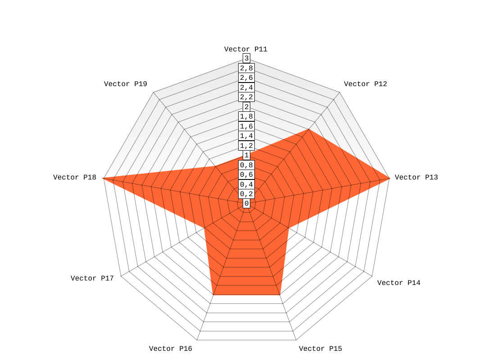

# Célula matemática, imagen y agentes en el Sistema Vectorial SV

**(p1+p3)-Bis · Marco explicativo del estudio · Versión 2 · 13 de septiembre de 2026**

**Autor: Juan Antonio Lloret Egea**  
ORCID: 0000-0002-6634-3351 · ITVIA — IA eñ™ · ISSN 2695-6411  
Preparación y contraste documental asistidos por Watson.

## 1. Qué se estudia y por qué debe conocerse antes del catálogo

Los fundamentos algebraico-semánticos rigen la representación y sus implementaciones. El SV debe conservar una correspondencia comprensible y verificable entre la célula matemática, su representación gráfica y el uso que hacen de ellas el experto y la IA. El nombre (p1+p3)-Bis identifica el estudio de esa correspondencia, como continuación de la integración entre significado del frame y control del trabajo de la IA.

Las células de conocimiento nuclear del dominio y los parámetros singulares de decisión comparten el mismo molde de representación. El molde organiza posiciones ternarias y permite dibujarlas como un polígono; el significado de cada posición, su procedencia y la operación a la que sirve deben estar declarados. Un mismo dibujo puede corresponder a conocimientos distintos si cambian esos vínculos.

SVperitus es la sede natural de los agentes especializados y sus realizaciones. El Lenguaje recibe las necesidades que puedan afectar a su capacidad de representar, preservar, validar o ejecutar lo constituido. Este documento explica la relación y delimita el estudio; no introduce una nueva versión de semántica, IR ni núcleo. [R1, R2]

## 2. El objeto matemático

El alfabeto es Σ = {0, 1, U}. Para una célula de tipo SV(n,b), b es un natural con b ≥ 3 y n = b². El objeto exacto es un producto cartesiano finito de estados semánticos: v ∈ Σⁿ, ordenado y posicional; no un espacio vectorial sobre un cuerpo. El espacio de estados posibles tiene cardinalidad 3ⁿ.

| Célula | Coordenadas de cada estado | Estados posibles |
| --- | --- | --- |
| SV(9,3) | 9 | 3⁹ = 19.683 |
| SV(16,4) | 16 | 3¹⁶ = 43.046.721 |
| SV(25,5) | 25 | 3²⁵ = 847.288.609.443 |
| SV(36,6) | 36 | 3³⁶ |
| SV(49,7) | 49 | 3⁴⁹ |

SV(9,3) es la célula mínima. No es una matriz 3 × 3. El exponente cuenta configuraciones posibles; no exige almacenarlas todas. No se redondean tamaños ni se rellenan posiciones con U sin constitución expresa. [R0, R1]

<!-- salto de página -->

## 2.1. El álgebra gobierna la representación

Los Fundamentos fijan la convención canónica: **0 = Apto, 1 = No_Apto y U = Indeterminado**. U expresa no determinación actual; no es un número ni un infinito algebraico. La codificación visible es **ρ(0) = 1, ρ(1) = 2 y ρ(U) = 3**. Son radios de representación: el anillo exterior de U no significa mayor gravedad. [R0, §§2–4 y 6]

Para i = 1,…,n, el fundamento define:

**θᵢ = 2π(i − 1)/n**  
**Vᵢ(v) = (ρ(vᵢ) cos θᵢ, ρ(vᵢ) sin θᵢ)**

La poligonal polar cerrada une V₁,…,Vₙ y vuelve a V₁. En coordenadas cartesianas habituales, esta expresión inicia el primer eje a la derecha y avanza en sentido antihorario. El ejemplo histórico inicia arriba y avanza en sentido horario. Compararlos exige explicitar la transformación del sistema de representación y conservar la correspondencia i ↔ parámetro; no se cambian los estados ni sus radios para igualar dibujos.

La imagen procede del objeto exacto. No es, en general, una función global y = f(x). Área y perímetro son magnitudes derivadas; no sustituyen ni el vector ni la regla de evaluación. El mismo principio rige las células de conocimiento y las de decisión: compartir molde no autoriza a invertir el significado de 0 y 1.

### Evaluación y composición tienen leyes explícitas

El fundamento establece T(n) = ⌊7n/9⌋. La evaluación es No_Apta si N₁ ≥ T(n), Apta si N₀ ≥ T(n), e Indeterminada en los demás casos. Para n = 9, 16, 25, 36 y 49, los umbrales son 7, 12, 19, 28 y 38. Esta es la regla documentada por el fundamento; una CNN no la determina. Su recepción en una realización del Lenguaje exige comprobar el contrato y su implementación. [R0, §5]

La composición es semánticamente tipada. El fundamento distingue vector interno, codominio, interpretación y rol estructural. No hay una ley binaria universal: dominancia, compuerta, sustitución en serie, supervisión y ensamblaje responden a relaciones distintas. Un max sólo procede con orden y compatibilidad declarados; el orden de radios no proporciona ese orden decisional. [R0, §7]

Los convenios históricos y sus revisiones se identifican por versión y contexto. Sus diferencias de significado o evaluación se conservan para el contraste. No se mezclan silenciosamente con la convención canónica ni se convierten por este documento en cambios del núcleo.

<!-- salto de página -->

## 2.2. Frame tipado y correspondencia entre sus componentes

Se adopta como requisito de diseño que el frame sea un objeto constituido y sujeto a contrato. Su representación conceptual puede expresarse como el par ordenado **Frame_C = (frmat, frvis)**, donde C identifica el contrato aplicable, frmat el estado matemático y frvis su representación visual asociada. Esta notación explica el vínculo requerido; no declara que ya exista un tipo homónimo en la IR.

La admisión del par requiere comprobar conjuntamente la validez de la célula y la correspondencia de su representación. La coexistencia de un vector admisible y una imagen legible no basta: ambos deben referirse a la misma instancia, estado, constitución y versión del contrato. Las posiciones conservan su identidad semántica en el dominio o agente que las define.

| Objeto del contrato | Obligación de conservación |
| --- | --- |
| Constitución | Dimensión admitida, alfabeto, número e identidad de posiciones. |
| Significado | Definición de cada parámetro, dominio o agente, reglas y procedencia. |
| Representación | Radios fundacionales, ejes y transformación declarada, orden y leyenda. |
| Estado e instancia | Correspondencia inequívoca entre el estado identificado y la imagen asociada. |
| Operaciones | Condiciones de evaluación, composición, revisión y emisión de resultados. |

La representación gráfica podrá materializarse cuando proceda si el contrato admite esa modalidad. El vínculo formal no obliga a mantener permanentemente un mapa de píxeles en el núcleo. Debe distinguirse, sin embargo, una representación pendiente de materialización de una imagen efectivamente producida y comprobada. Una imagen de un estado anterior no puede presentarse como representación del nuevo estado.

La encapsulación del objeto debe impedir que el consumidor autorizado sustituya libremente sus componentes o eluda las comprobaciones de admisión. Las entradas externas se validan antes de adquirir reconocimiento como frame SV. La existencia de un contenedor informático denominado Frame no acredita por sí sola conformidad algebraica o semántica.

La estructura transversal preserva las restricciones comunes. El dominio constituye el conocimiento y sus relaciones; el agente declara su cobertura, objetivos y capacidades. Compartir el molde gráfico permite usos especializados distintos, manteniendo explícitos sus contratos. [R0, R1, R7]

<!-- salto de página -->

## 2.3. Dimensión fija y alcance declarado por versión

El diseño distingue tres niveles: la familia matemática admisible, el conjunto de tamaños soportados por una versión y la dimensión de cada célula constituida. Esta distinción permite acotar la realización actual y conservar una vía explícita de extensión.

| Nivel | Condición |
| --- | --- |
| Fundamento | n = b², con b natural y b ≥ 3; se conservan las restricciones algebraico-semánticas. |
| Versión de soporte | Declara un conjunto finito D_v de tamaños admitidos y los límites de recursos correspondientes. |
| Instancia celular | Tiene exactamente N posiciones, con N perteneciente a D_v, y conserva su dimensión tras la admisión. |

D_v representa aquí una obligación de declaración. Este documento no constituye su contenido ni fija un N máximo universal. Los tamaños necesarios deben obtenerse de las células constituidas por los dominios competentes. La existencia de ejemplos de 9, 16, 25, 36 o 49 posiciones no demuestra que esa lista sea suficiente para todos los universos presentes o futuros.

La evolución de los estados ternarios conserva la dimensión y la identidad de las posiciones bajo las operaciones autorizadas. Cambiar la cardinalidad exige una nueva constitución y una relación explícita con el objeto anterior; no se admite como crecimiento ordinario de la misma célula. La revisión conserva la trazabilidad exigida por el sistema.

### Regla de extensión controlada

**Cada versión declara los tamaños celulares admitidos. Toda célula mantiene fija su dimensión tras la admisión. Incorporar un tamaño adicional requiere revisión de impacto, límites de recursos y pruebas de conformidad; se modifican semántica o IR cuando el análisis demuestre que resulta necesario.**

La revisión de impacto examina representación, identidad, posiciones, evaluación, composición, correspondencia gráfica y costes. Si las estructuras y operaciones existentes expresan la nueva dimensión sin pérdida, la ampliación puede limitarse al soporte y su verificación. Si aparece una insuficiencia, se documenta un caso discriminante y se determina la sede de la modificación. El requisito de revisión no equivale a imponer automáticamente una nueva versión de semántica y de IR ante cada tamaño adicional.

Los consumidores de una versión deben reconocer los tamaños que soportan y rechazar expresamente los restantes. No se admiten truncamiento, redondeo, relleno con U ni reinterpretación silenciosa para adaptar una célula a un tamaño disponible. [R1, R7]

<!-- salto de página -->

## 2.4. Realización en Rust y representatividad de las pruebas

En Rust, un array [Tri; N] tiene longitud fija y N forma parte del tipo. Vec<Tri> registra longitud y capacidad, pero permite modificar su longitud. Ambos conocen cuántos elementos contienen. La diferencia relevante para la célula admitida es la facultad de crecimiento del contenedor. [R9]

La opción preferente de estudio es un almacenamiento de longitud fija encapsulado, con construcción validada. Un conjunto finito de tamaños soportados permite disponer de realizaciones con arrays y seleccionar la correspondiente al recibir el contrato. Si se necesita otra estrategia de almacenamiento, deberá preservar la misma invariancia; conocer N en ejecución no obliga a permitir crecimiento posterior. La elección definitiva requiere contraste con la IR y medición de sus costes.

El array no sustituye las restricciones del SV: Rust admite longitudes que no cumplen n = b². La construcción del objeto debe comprobar las dimensiones soportadas y la constitución recibida. Su interfaz de uso no debe permitir añadir o retirar posiciones libremente, alterar sus identidades ni sustituir una imagen sin mantener el vínculo contractual.

### SV(9,3): mínimo admisible y ausencia de valor predeterminado

**SV(9,3) es la célula mínima; no se adopta como tamaño predeterminado ni como patrón representativo de toda la carga de trabajo.** Cada célula declara su N. Omitir la dimensión no autoriza a asignar nueve posiciones ni a fragmentar conocimiento en células de ese tamaño por conveniencia de implementación.

El autor prevé una presencia escasa, eventualmente nula en determinados usos, de células de nueve posiciones para conocimiento nuclear y decisión singular. Esta previsión orienta el diseño y deberá contrastarse con las constituciones y cargas efectivas; no constituye una frecuencia medida ni una prohibición de uso.

Las células de nueve posiciones podrán desempeñar funciones puntuales de supervisión o guarda cuando así se constituyan. Su dimensión no les confiere autoridad: la capacidad de habilitar o vetar una composición procede del rol y del contrato aplicable.

### Coste y cobertura del contraste

Las dimensiones mayores admitidas y sus composiciones deben formar parte central de las pruebas. La conformidad observada sólo con nueve posiciones no acredita el resto. Deben comprobarse preservación posicional, paridad gráfica, evaluación, composición y rechazo de tamaños no soportados.

Acotar N facilita estimar el almacenamiento de coordenadas, pero no limita por sí solo la memoria total. También deben acotarse cantidad de células, composiciones, textos y evidencias asociados, representaciones visuales y concurrencia. Este documento no atribuye una mejora de rendimiento a arrays frente a otras realizaciones sin medición.

<!-- salto de página -->

## 3. Dos funciones del conocimiento y un mismo molde gráfico

| Función | Qué expresa | Qué debe declarar |
| --- | --- | --- |
| Conocimiento nuclear del dominio | Conocimiento delimitado que constituye un universo y permite precisar qué sabe o cubre una unidad especializada. | Universo, significado, fuentes, posiciones, relaciones y límites. |
| Parámetros singulares de decisión | Aspectos concretos que se observan o evalúan para un objetivo: acotar un problema, vigilar una condición o contribuir a una decisión. | Objetivo, evidencia requerida, criterios, contexto, salida y dependencias. |

«Nuclear del dominio» no significa que el contenido médico o de ciberseguridad deba incorporarse al núcleo universal del Lenguaje. La distinción anterior es funcional: no constituye por sí sola dos nuevos tipos de IR ni concede al agente permiso para inventar parámetros.

En el ejemplo de un ordenador que no funciona, el especialista distingue alimentación, arranque, conectividad, aplicaciones o memoria. Una composición celular puede organizar esas comprobaciones cuando su constitución y sus relaciones sean explícitas. Cada célula conserva las posiciones que fundamentan su resultado. El mismo principio permite al inmunólogo inspeccionar un conjunto delimitado de observaciones sin reducir el expediente completo a una frase del paciente.

El profesional necesita poder recorrer el resultado hasta la posición, su valor, su criterio y su fuente. La imagen aporta una lectura conjunta; el detalle permite justificarla. Compartir el molde visual facilita esa lectura entre especialidades, pero no convierte sus reglas particulares en intercambiables.

### El resumen terminal y la composición

Una salida Apto / No apto / Indeterminado resume una evaluación conforme a la operación y al codominio declarados. No sustituye al vector ni conserva necesariamente todas sus distinciones. Dos vectores diferentes pueden producir la misma salida y seguir siendo diferentes para otra consulta.

Si el resultado de una célula alimenta otra, la correspondencia debe declararse. El compositor histórico IMMUNO-1 → IMMUNO-2 presenta una traducción explícita hacia P25: APTO → 0, NO_APTO → 1 e INDETERMINADO → U. Es un antecedente experimental, no una autorización universal para convertir cualquier salida terminal en Tri ni una validación de esa dependencia clínica. [R3]

U pertenece a una posición válida y conserva la indeterminación prevista por su contrato. Un fallo del sensor, del archivo, del renderizador o del modelo necesita su diagnóstico propio; no se absorbe automáticamente en U. [R1]

<!-- salto de página -->

## 4. El antecedente de 2021: una imagen parametrizada que también consume la IA

El framework de intrusión seleccionaba nueve parámetros: destino web, comunicación no cifrada, transferencia de datos, BSSID, Bluetooth, GPS, cámara, audio y condiciones físicas. Su obtención se planteaba mediante reglas IDS y monitores. El ejemplo del apartado 3.3 utiliza:

**v = (0, 1, U, 0, 1, 1, 0, U, 0)**

La representación asigna 0 → radio 1, 1 → radio 2 y U → radio 3. Sitúa P11 arriba y recorre nueve ejes en sentido horario, separados 40°. Los vértices unidos forman la imagen del estado. La distancia radial codifica el valor; no es una escala general de gravedad. [R4]

*Figura original aportada por el autor. P13 y P18 alcanzan el radio 3; P12, P15 y P16 el radio 2; las demás posiciones, el radio 1. La célula tiene nueve coordenadas, aunque la imagen se materialice en un soporte bidimensional.*

El recorrido propuesto comprende observaciones, parámetros ternarios, imagen polar, clasificación por una CNN y revisión profesional. La explicación técnica identifica ResNet34 y distingue entrenamiento de ejecución del modelo guardado. La imagen tiene así una función visual y una función de entrada al clasificador. El ejercicio didáctico de entrenamiento con gatos y tigres no acredita métricas de intrusión sobre polígonos. [R4]

La copia consultada conserva el antecedente de 2021 y una actualización de 2026; sus formulaciones deben leerse con esa distinción temporal.

<!-- salto de página -->

## 5. Continuidad en SVperitus y papel de las distintas IA

SVperitus contiene una realización histórica más específica: el Documento 7 y los scripts de IMMUNO-1 describen casos sintéticos, un motor normativo que produce vectores y etiquetas, generación de polígonos y entrenamiento de una CNN para emular la clasificación. El conocimiento y las reglas preceden al aprendizaje del modelo. [R5]

El generador común reutiliza los radios 1, 2 y 3 para 0, 1 y U. El número de posiciones determina la separación angular. Un PNG de 224 × 224 píxeles es un soporte de la representación, no el tamaño matemático de la célula. La orientación y el sentido se contrastan con la definición fundacional; color y resolución tampoco pueden ocultar posiciones o alterar su lectura. [R6]

La presencia del código acredita que existe ese antecedente. Su reutilización requiere comprobar coherencia entre configuración, rutas, etiquetas, modelo, transformaciones y evaluación. Este estudio ha localizado discrepancias concretas; no atribuye un entrenamiento nuevo ni una aptitud productiva al material recibido.

### ¿Puede la IA de NLP trabajar también con estas células?

La pregunta debe resolverse por capacidades y tareas, no por compartir el nombre «IA». Se distinguen tres trabajos:

- **Texto y datos estructurados:** extraer candidatos de documentos, localizar evidencia y explicar posiciones o resultados dentro del permiso recibido.
- **Visión:** consumir la imagen efectiva del frame y realizar la tarea visual especificada.
- **Clasificación aprendida:** producir una predicción auxiliar cuya correspondencia con el criterio de referencia se mide.

Un modelo sólo textual no recibe píxeles por el hecho de recibir el vector escrito. Una realización con capacidad visual podría cubrir ambos canales, o un sistema podría coordinar modelos distintos. En ambos casos deben acreditarse las capacidades concretas, el modelo y su versión, las entradas efectivamente consumidas y el límite de sus salidas. Aquí no se selecciona modelo ni se afirma que el de NLP ya pueda sustituir a la CNN.

Las predicciones y explicaciones auxiliares permanecen identificadas como tales. Ninguna CNN o IA lingüística adquiere por esa función la autoridad de asignar una decisión soberana, alterar la constitución o cerrar U por plausibilidad. Esta separación figura en los Pilares y en la presentación actual de SVperitus. [R1, R2]

<!-- salto de página -->

## 6. Qué significa comprobar la paridad

La paridad requiere declarar qué objetos se comparan y qué propiedad debe conservarse. La semejanza a simple vista o un archivo íntegro no bastan para todas las obligaciones.

| Relación | Comprobación necesaria |
| --- | --- |
| Parámetro ↔ posición | Identidad, definición, orden y vínculo con la constitución recibida. |
| Estado ↔ imagen | Radios canónicos; correspondencia con los ejes fundacionales, orden, leyenda y transformación declarada. |
| Imagen ↔ consumidor | Identidad del artefacto realmente mostrado o entregado al modelo y transformaciones aplicadas. |
| Estado ↔ resultado | Operación, regla, codominio, entradas y procedencia del resultado. |
| Resultado ↔ explicación | Afirmaciones respaldadas por posiciones, reglas y fuentes recuperables. |
| Célula ↔ composición | Puente declarado, versiones, contexto y conservación de la información requerida. |

La identidad de bytes del archivo es una propiedad distinta de la conservación de significado. Una imagen rasterizada tampoco se presume reversible de manera exacta: si se pretende recuperar el vector desde ella, esa recuperación necesita contrato y prueba. Si la recuperación utiliza datos adicionales, esa dependencia debe declararse. [R7]

La relación se puede estudiar con controles positivos y alteraciones discriminantes: intercambiar dos posiciones conservando sus conteos, invertir orientación, intercambiar 1 y U, cambiar una leyenda, entregar una imagen de otra instancia, sustituir un modelo o remapear incorrectamente una clase. Son obligaciones para un banco posterior; su enumeración no significa que ya hayan sido ensayadas.

Una transformación de entrenamiento, como rotación o reflexión, podría conservar una clase basada sólo en conteos y, al mismo tiempo, cambiar qué posición se identifica como origen del problema. Por eso, acertar la clase global no prueba fidelidad posicional ni suficiencia para explicar el caso.

Las fuentes externas y sus instrucciones incrustadas se reciben como datos sujetos a control. El canal de explicación o de visión no puede convertir un documento en autorización para cambiar reglas, ocultar evidencia o actuar fuera de permiso. Su protección necesita prueba propia en la tubería correspondiente.

<!-- salto de página -->

## 7. Reparto de trabajo y relación con el catálogo

La estructura común debe examinarse ahora, antes de consolidar un alcance del núcleo que la necesite. La decisión sobre una extensión de semántica o IR exige localizar primero una pérdida o una obligación no representada, aportar un caso discriminante y determinar la sede del remedio. Compartir un molde gráfico no justifica por sí solo añadir tipos al Lenguaje. [R1, R7]

| Sede | Responsabilidad en este estudio |
| --- | --- |
| Dominio | Constituir conocimiento, parámetros, posiciones, reglas, fuentes y relaciones. |
| Agente en SVperitus | Declarar cobertura, objetivos, operaciones, capacidades, permisos y uso singular de las células recibidas. |
| Lenguaje y núcleo | Preservar y validar los invariantes y las relaciones que admita su versión; explicitar insuficiencias. |
| Renderizador, frontera y host | Materializar la representación y el intercambio conforme al contrato, con recursos y fallos identificados. |
| IA auxiliar | Trabajar sobre las entradas autorizadas y entregar salidas trazables dentro de su capacidad acreditada. |
| Experto humano | Inspeccionar, contrastar y ejercer la autoridad que le corresponde, con correcciones conservadas. |

Las células de conocimiento nuclear y los parámetros singulares de decisión comparten molde, pero sus constituciones y usos siguen siendo explícitos. Los fundamentos rigen el contraste. Las reglas o codificaciones divergentes de antecedentes requieren resolución explícita antes de reutilizarlos; no se trasladan automáticamente al universo vigente.

La continuación tiene dos preguntas técnicas abiertas: qué correspondencias ya preservan la semántica V0.2 y la IR 0.3 en la realización vigente, y qué capacidades NLP/visión resultan suficientes para las tareas autorizadas. Son objeto del estudio, no incertidumbres que deban ocultarse para publicar esta explicación.

El catálogo recibirá después las causas delimitadas, con condición de emisión, etapa, evidencia y distinción entre fallo técnico, no admisión, discrepancia y resultado válido indeterminado. Los hallazgos preliminares no se convierten aquí en códigos canónicos de error.

**Estado:** versión 2 del encuadre documental de (p1+p3)-Bis, con los acuerdos de diseño sobre frame tipado y dimensión fija. No acredita paridad integrada, entrenamiento, suficiencia clínica ni promoción nuclear. El orden futuro de agentes se decidirá tras el trabajo inmunológico correspondiente; este estudio no lo anticipa.

<!-- salto de página -->

## 8. Fuentes y continuidad de lectura

Primero se leen los fundamentos; después, las restricciones de realización y los antecedentes contrastados. Los enlaces fijan cortes del repositorio.

R0. [Fundamentos algebraico-semánticos del Sistema Vectorial SV](https://github.com/juantoniolloretegea/SV-lenguaje-de-computacion/blob/fa3eb727799c322090e4e9126f81238cd198b9cc/docs/calidad/tuberias-ia/paridad-imagen-celula-matematica/Fundamentos%20algebraico-sem%C3%A1nticos%20del%20Sistema%20Vectorial%20SV.md), 09/03/2026, lectura íntegra. Objeto exacto, radios, evaluación, composición tipada e IA subordinada.

R1. [Pilares y restricciones de diseño del Lenguaje SV](https://github.com/juantoniolloretegea/SV-lenguaje-de-computacion/blob/19540321089dc48e4239e1f88324d1056c8caff4/docs/calidad/PILARES_Y_RESTRICCIONES_DE_DISENO_DEL_LENGUAJE_DE_COMPUTACION_SV_2026_09_05.md), §§1–5 y 7–9. Invariantes, competencias y límites.

R2. [SVperitus: presentación y organización](https://github.com/juantoniolloretegea/SVperitus-dataset/blob/47dc27aec9e7b517c27cfcf39b7ad1b186d36a4c/README.md). Sede de agentes y subordinación de las capas auxiliares.

R3. [Compositor histórico IMMUNO-1 → IMMUNO-2](https://github.com/juantoniolloretegea/SVperitus-dataset/blob/47dc27aec9e7b517c27cfcf39b7ad1b186d36a4c/agentes/inmunologia/fase_2/compositor/compose.py). Puente experimental y límite de interpretación.

R4. Framework basado en imágenes parametrizadas sobre ResNet, antecedente de 2021, copia con actualización de 2026 aportada por el autor. DOI: 10.21428/39829d0b.981b7276. La copia Markdown y el SVG original se conservan en esta misma carpeta.

R5. [Documento 7: IMMUNO-1](https://github.com/juantoniolloretegea/SVperitus-dataset/blob/47dc27aec9e7b517c27cfcf39b7ad1b186d36a4c/documentos/serie/Documento7_IMMUNO-1.md), §§1.2, 2, 6 y 7; [entrenamiento](https://github.com/juantoniolloretegea/SVperitus-dataset/blob/47dc27aec9e7b517c27cfcf39b7ad1b186d36a4c/agentes/inmunologia/fase_1/src/train_resnet.py), [evaluación](https://github.com/juantoniolloretegea/SVperitus-dataset/blob/47dc27aec9e7b517c27cfcf39b7ad1b186d36a4c/agentes/inmunologia/fase_1/src/evaluate.py) y [configuración](https://github.com/juantoniolloretegea/SVperitus-dataset/blob/47dc27aec9e7b517c27cfcf39b7ad1b186d36a4c/agentes/inmunologia/fase_1/config/imm_n25.yaml). Las discrepancias entre estas piezas se registran en el estudio.

R6. [Generador común de polígonos](https://github.com/juantoniolloretegea/SVperitus-dataset/blob/47dc27aec9e7b517c27cfcf39b7ad1b186d36a4c/comun/polygons.py) y [generación de imágenes IMMUNO-1](https://github.com/juantoniolloretegea/SVperitus-dataset/blob/47dc27aec9e7b517c27cfcf39b7ad1b186d36a4c/agentes/inmunologia/fase_1/src/generate_polygons.py).

R7. [Acta de perfiles, contratos y ensamblaje](https://github.com/juantoniolloretegea/SV-lenguaje-de-computacion/blob/19540321089dc48e4239e1f88324d1056c8caff4/docs/calidad/ACTA_TECNICA_DE_PERFILES_CONTRATOS_Y_ENSAMBLAJE_DEL_LENGUAJE_SV_2026_09_06.md), §§6–9. Método para decidir suficiencia y sede de una modificación.

R8. [Índice de la colección SVcustos–SVperitus aportado por el autor](antecedentes/INDICE_COLECCION_SVCUSTOS_SVPERITUS_2026_09_13.pdf). Impresión de siete páginas; DOI de colección 10.21428/39829d0b.1129de25. Contiene resúmenes y enlaces, no el texto completo de los capítulos. Los capítulos Markdown añadidos por el autor se inventarían en el expediente; no se confunden con esta impresión.

R9. Documentación oficial de Rust: [array](https://doc.rust-lang.org/std/primitive.array.html) y [Vec](https://doc.rust-lang.org/std/vec/struct.Vec.html). Longitud fija, longitud variable y capacidad. Consulta: 13/09/2026. Las propuestas de diseño SV se distinguen de estas propiedades del lenguaje.

[Expediente y estado del estudio](estudio-nucleo-agentes/README.md) · [Léame primero](../frame-significado-humano-trazabilidad-y-fidelidad/LEAME_PRIMERO.md).

[Historial de la revisión 2](estudio-nucleo-agentes/REVISION_V2.md). La primera edición se conserva como antecedente documental.
