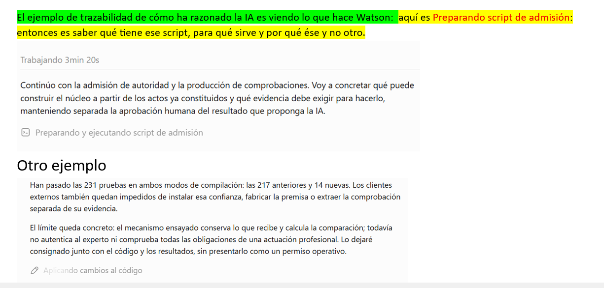
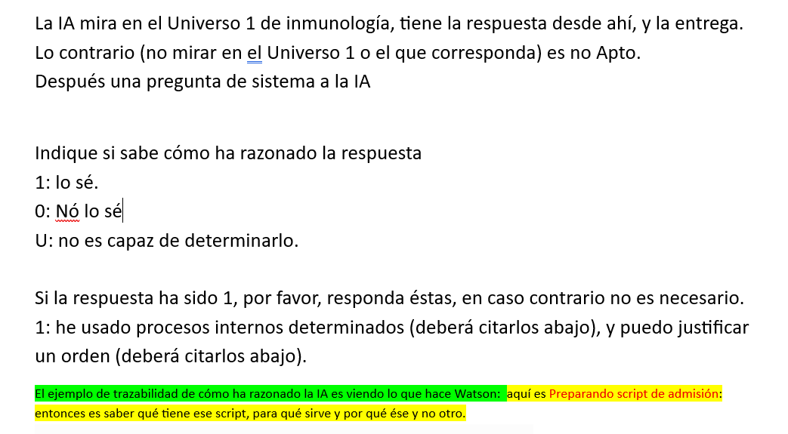
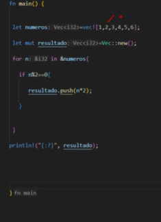
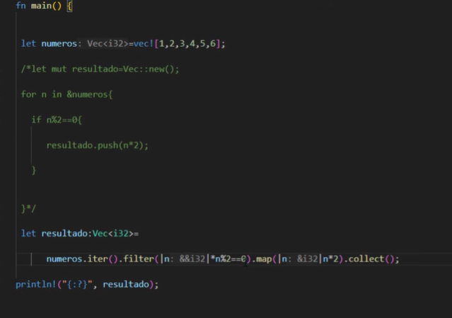
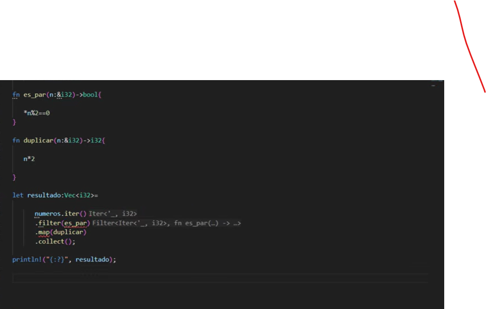

# Trazabilidad, auditoría y reproducción del trabajo de la IA

## Apuntes de referencia para Watson, Claude, Grok y otras unidades

**Autor de la explicación y director del proyecto:** Juan Antonio Lloret Egea.  
**Preparación editorial:** Watson, asistente de IA bajo la dirección del autor.  
**Fecha:** 12 de septiembre de 2026.  
**Naturaleza:** exposición ordenada de los apuntes de conversación. No es una transcripción literal ni un acta de cierre técnico.

### 1. El fundamento de la propuesta

Una inteligencia artificial puede resolver una misma tarea mediante procedimientos diferentes. La exigencia es que use el conocimiento que corresponde, respete las reglas aplicables y entregue un resultado correcto y comprobable. Cuando la tarea fija una salida única para unos datos y unas condiciones determinados, las distintas realizaciones válidas deben producir esa misma salida.

La libertad de procedimiento permite comparar soluciones, mejorar su claridad y medir su consumo de recursos. Esa diversidad no elimina la obligación de conservar las pruebas de lo que se hizo. El trabajo debe poder seguirse mediante sus operaciones, sus artefactos y sus resultados efectivos.

La explicación del autor reúne seis fundamentos: **conocimiento constituido, procedimiento identificable, resultado comprobable, artefactos conservados, recorrido auditable y costes medidos**. La prosa enlaza estos elementos para que otra persona pueda comprender su relación y examinarla.

### 2. Relación con el expediente del frame

El [expediente del frame](../frame-significado-humano-trazabilidad-y-fidelidad/README.md) explica la relación entre la representación computable, el significado que debe preservarse y la presentación que comprende el profesional. Este expediente complementa aquella explicación: concreta qué debe conservarse del trabajo que conduce a una respuesta, una transformación o una entrega.

El frame ayuda a preguntar qué conocimiento se conserva, se pierde o se altera. La trazabilidad del trabajo permite examinar qué operaciones y qué materiales intervinieron en ese recorrido. Ambas carpetas forman una referencia de continuidad para futuras unidades, aplicable a distintos dominios.

### 3. Alcance de la expresión «qué pensó Watson»

En estos apuntes, la expresión designa las decisiones expresadas o materializadas en el trabajo: qué operación se eligió, qué script se preparó, qué código se modificó, qué datos se usaron y qué resultados se obtuvieron. La explicación del propósito puede acompañar esa evidencia.

El alcance auditable se fija sobre esos elementos observables y conservados. No presupone acceso completo al funcionamiento interno del modelo. Una explicación verbal y una ejecución registrada son piezas distintas; deben poder vincularse sin atribuir a una el valor probatorio de la otra.

<!-- pagebreak -->

## 4. Primer ejemplo: consultar el universo que corresponde

El autor propone una pregunta hipotética sobre un valor de plaquetas inferior al umbral de referencia facilitado por un laboratorio. Utiliza inmunología como ejemplo inicial, pero la idea se dirige a cualquier dominio.

En el escenario propuesto, la IA debe acudir al **Universo 1 que corresponda a la cuestión**, con el conocimiento y las referencias constituidos para responder. El valor y el umbral deben conservar su procedencia y sus condiciones de interpretación. Contestar sin consultar el universo pertinente se considera **No apto** según el criterio de evaluación planteado por el autor.

Este ejemplo no fija cifras, diagnósticos ni reglas clínicas. Tampoco acredita que una operación clínica concreta ya cubra la pregunta. Su función es mostrar que la procedencia del conocimiento forma parte del examen del trabajo.

### 4.1. Pregunta de sistema propuesta

Tras la respuesta, se plantea a la IA: **«Indique si sabe cómo ha razonado la respuesta».**

| Respuesta | Declaración de la IA |
| --- | --- |
| 1 | Lo sé. |
| 0 | No lo sé. |
| U | No soy capaz de determinarlo. |

Si responde **1**, se solicita que identifique los procesos utilizados y justifique su orden. La formulación inicial del autor pide citar los procesos determinados y el orden que la IA afirma poder justificar.

Si responde **0** o **U**, ese desarrollo posterior no se exige en el planteamiento original. Estas respuestas no son, por sí mismas, una atribución de mala conducta. Tampoco deben confundirse con el criterio anterior de consulta del universo pertinente.

### 4.2. Declaración y comprobación

Responder **1** abre la descripción del procedimiento. Para acreditar lo descrito, se vincula la declaración con los materiales y registros disponibles: fuentes consultadas, scripts, cambios de código, invocaciones y resultados. Decir que se realizó una operación no sustituye la conservación de su evidencia.

La tabla recoge una **propuesta de interrogación y evaluación**. No constituye por sí sola un ternarizador, una célula ni una ampliación de la semántica del SV. Su significado se mantiene en el alcance de estos apuntes.

<!-- pagebreak -->

## 5. Tres formas de resolver el mismo ejemplo en Rust

La entrada es `[1, 2, 3, 4, 5, 6]`. El encargo consiste en seleccionar los pares, multiplicarlos por dos, almacenarlos en otro vector e imprimirlos. La salida esperada es **`[4, 8, 12]`**, en ese orden. Los tres fragmentos siguientes se sitúan dentro de `main`.

### 5.1. Procedimiento imperativo

```rust
let numeros: Vec<i32> = vec![1, 2, 3, 4, 5, 6];
let mut resultado = Vec::new();
for n in &numeros {
    if n % 2 == 0 {
        resultado.push(n * 2);
    }
}
println!("{:?}", resultado);
```

### 5.2. Iteradores con funciones anónimas

```rust
let numeros: Vec<i32> = vec![1, 2, 3, 4, 5, 6];
let resultado: Vec<i32> = numeros.iter()
    .filter(|n| **n % 2 == 0)
    .map(|n| n * 2)
    .collect();
println!("{:?}", resultado);
```

### 5.3. Iteradores con dos funciones nombradas

```rust
fn es_par(n: &&i32) -> bool { **n % 2 == 0 }
fn duplicar(n: &i32) -> i32 { n * 2 }

let numeros: Vec<i32> = vec![1, 2, 3, 4, 5, 6];
let resultado: Vec<i32> = numeros.iter()
    .filter(es_par)
    .map(duplicar)
    .collect();
println!("{:?}", resultado);
```

**Nota editorial de tipos:** en la tercera captura, `es_par` recibe `&i32`. Para esa cadena con `.iter()`, el predicado de `filter` recibe `&&i32`; la edición lo corrige expresamente. En el segundo fragmento se hace explícita la doble desreferenciación. Las capturas originales se conservan sin modificación.

Los tres fragmentos editados se han compilado y ejecutado: los tres imprimieron `[4, 8, 12]`. El script de comprobación, las fuentes ejecutadas y las salidas están conservados en `soporte/RESULTADOS_EJEMPLOS.json`.

Los tres procedimientos expresan la misma transformación sobre la entrada fijada. Su posible elegancia o rendimiento se evalúa por separado. Este ejemplo no demuestra equivalencia universal para cualquier cambio de entrada, tipo o condición de ejecución.

<!-- pagebreak -->

## 6. Del anuncio de una acción a su evidencia

Juan Antonio aporta dos ejemplos del trabajo de Watson: **preparar y ejecutar un script de admisión** y **aplicar cambios al código**. En ambos, el texto que precede a la acción explica su finalidad. El anuncio visible ayuda a seguir la actividad, pero el examen técnico requiere recuperar su contenido efectivo.



### 6.1. Qué se conserva para examinar cada operación

| Elemento | Evidencia que permite auditarlo |
| --- | --- |
| Pregunta y finalidad | Encargo, datos recibidos y criterio de resultado correcto. |
| Conocimiento utilizado | Fuente o universo consultado, versión y fragmento relevante. |
| Script | Archivo exacto utilizado, ubicación, versión e instrucciones de ejecución. |
| Cambio de código | Estado previo, modificación aplicada, estado resultante y destino. |
| Ejecución | Invocación, entradas, orden y dependencias entre operaciones. |
| Resultado | Salidas, errores, comprobaciones y alcance de lo que se verificó. |
| Tiempo y recursos | Magnitud medida, unidad, intervalo y condiciones de medición. |
| Propósito declarado | Explicación breve enlazada con la operación y su evidencia. |

Saber por qué se eligió un script resulta conveniente, pero el autor no lo establece como obligación general. Sí exige que se pueda conocer **qué script se manejó, qué hacía y dónde quedó guardado**. Lo mismo se aplica al código y a los resultados.

La captura conserva un anuncio histórico de 231 pruebas. Incluirlo aquí documenta el ejemplo aportado; no equivale a volver a ejecutar aquella campaña ni a ampliar lo que acreditó.

<!-- pagebreak -->

## 7. Corrección, reproducción y coste

### 7.1. Comprobar que se alcanzó el objetivo

El resultado se contrasta con las reglas y condiciones del problema. En el ejemplo de Rust, debe obtenerse `[4, 8, 12]` a partir de la entrada fijada y mediante la selección y transformación pedidas. Coincidir casualmente con una salida esperada no justifica cualquier procedimiento.

El autor añade la analogía de una integral: distintas personas pueden encontrar caminos válidos mediante cambio de variable, integración por partes o una sustitución trigonométrica, cuando resulten aplicables. La corrección puede contrastarse, por ejemplo, derivando la primitiva obtenida en su dominio de validez. Las expresiones finales pueden ser equivalentes sin estar escritas de la misma forma.

### 7.2. Reproducir el trabajo conservado

Para repetir una ejecución se necesitan el script o código exactos y también sus entradas, dependencias, versiones de herramientas, configuración y condiciones relevantes. Si intervienen aleatoriedad, servicios externos o estado cambiante, esos factores deben quedar identificados en el alcance de la reproducción.

Reejecutar un artefacto conservado permite contrastar su comportamiento. Pedir a otra unidad que vuelva a inventar una solución constituye una operación diferente. La continuidad buscada se apoya en recuperar y examinar lo producido.

### 7.3. Medir antes de optimizar

Una versión funcional puede parecer más elegante que una imperativa. Eso no prueba que consuma menos memoria ni que tarde menos. La comparación requiere mediciones realizadas bajo condiciones comparables.

Conviene distinguir duración total, tiempo de ejecución y esperas. Una duración mostrada por la interfaz no informa por sí sola de todos los recursos consumidos. Cuando una magnitud no se haya medido, debe constar como no medida. Si existe un presupuesto obligatorio de recursos, su cumplimiento forma parte del contrato de la tarea.

## 8. Auditoría, presentación y escenario adversarial

El planteamiento comienza en un escenario sin ataques para fijar la relación entre tarea, procedimiento y resultado. Después se extiende al examen de alteraciones, omisiones o sustituciones deliberadas. La captura y la custodia de evidencia deben tener un alcance identificable y permitir contrastar lo declarado con lo conservado.

La expresión del autor «cazamos todo» sintetiza la amplitud del fundamento propuesto. Él mismo aclara que conoce la inexistencia de seguridad perfecta: **su conclusión es que están los cimientos conceptuales del enfoque**. Esta edición conserva ese sentido, sin convertirlo en una afirmación de cobertura universal demostrada.

Poner en orden la «cocina y el taller» significa preparar una presentación clara y navegable. Los originales, intentos fallidos y rectificaciones permanecen recuperables. La limpieza editorial no borra la historia del trabajo.

<!-- pagebreak -->

## 9. Continuidad para otras unidades

Una unidad Watson, Claude o Grok que retome este asunto debe partir de lo siguiente:

1. La finalidad es comprobar el trabajo y el resultado mediante evidencia recuperable.
2. Puede haber varios procedimientos válidos para un mismo encargo; su diversidad no constituye un defecto.
3. El conocimiento pertinente y las reglas aplicables delimitan lo que puede afirmarse.
4. Los anuncios y explicaciones se enlazan con artefactos concretos; una declaración favorable no se acredita a sí misma.
5. La reproducción conserva las condiciones relevantes de ejecución; la optimización requiere medición.
6. El expediente del frame y este documento se leen conjuntamente, sin exigir al autor que vuelva a reconstruir la misma explicación.

Esta consolidación documental no cambia el núcleo, no distribuye nuevas responsabilidades entre dominio y agente y no declara cerrada la seguridad. El SV no se trata como un espacio vectorial. Las leyes constituidas y las decisiones de cada dominio mantienen la sede fijada por sus documentos rectores.

Al corte consultado, el siguiente objeto técnico de RETP-154 sigue siendo la recepción material de la premisa y los verificadores pendientes. Este expediente facilita su continuidad; no acredita esa realización por el hecho de describirla.

### 9.1. Procedencia y criterio editorial

La fuente principal es la explicación de Juan Antonio en esta conversación: el supuesto de consulta del universo, la pregunta de sistema, los ejemplos de Watson y Rust, la analogía de la integral, la conservación de artefactos, los costes y la aclaración sobre los cimientos del enfoque. El texto es una síntesis redactada; no atribuye a Claude ni a Grok una revisión que no han realizado.

Se conservan cinco capturas originales en `imagenes`, sin alterar sus bytes. Los fragmentos de Rust se transcriben para facilitar la lectura y contienen la corrección de tipos indicada en §5.3. El PDF y el Markdown presentan el mismo contenido de referencia. El manifiesto identifica los archivos y sus huellas; es un apoyo de integridad documental, no una certificación del origen humano.

### 9.2. Referencias de continuidad

- [Frame: significado humano, trazabilidad y fidelidad](../frame-significado-humano-trazabilidad-y-fidelidad/README.md).
- [Recepción gobernada y comprobación observada, RETP-154](../recepcion-gobernada-y-comprobacion-observada/README.md).
- [Índice de tuberías IA](../inicio.md).

**Cortes consultados:** Lenguaje, `main`, `19ade5d9be68901815bd284cc5631f20f08d3fa3`; laboratorio, `lab/playground-sv-permanente`, `b9c623294c35b9f59f8ed6a3540cefeb12c84bd7`. Se cotejaron las rectoras ya leídas —Pilares, perfiles y ensamblaje, acta de conformidad y secuencia IMM, y workflow V2—: sus bytes permanecían iguales. Las referencias privadas de agosto no se reproducen en esta edición pública.

<!-- pagebreak -->

## Anexo A. Pregunta de sistema aportada por el autor



La captura documenta la formulación original. La redacción ordenada y el alcance de la propuesta se recogen en §4. Se mantienen los originales para distinguir los apuntes recibidos de su edición.

## Anexo B. Primera realización en Rust



La reducida resolución procede de la imagen aportada. La transcripción legible figura en §5.1.

<!-- pagebreak -->

## Anexo C. Segunda y tercera realizaciones en Rust

### Iteradores con funciones anónimas



### Iteradores con funciones nombradas



La captura de las funciones nombradas conserva la firma original de `es_par`. La corrección editorial necesaria para esa cadena con `.iter()` está identificada en §5.3; no se ha retocado la imagen para ocultarla.
