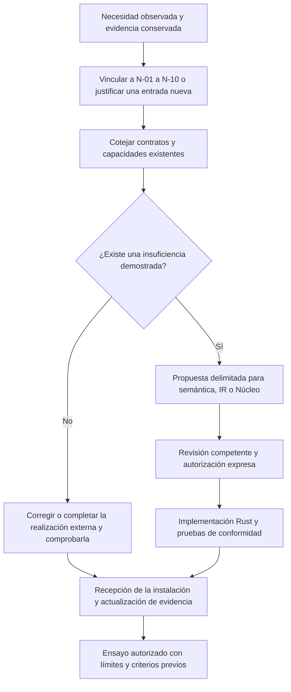

# Necesidades de evolución del SV surgidas de las pruebas con inteligencia artificial

**Versión 1.0 · 4 de octubre de 2026. Estado: revisión documental inicial; integración y aprobación pendientes.**

Este expediente reúne las necesidades observadas al incorporar recuperación documental, inferencia y revisión contextual a los ensayos del SV. Su finalidad es determinar qué puede realizarse en los componentes externos, qué requiere un contrato más preciso y qué, sólo después de su evaluación y aprobación, exigiría una evolución del Lenguaje o del Núcleo.

**No modifica ni aprueba cambios en el Núcleo, la semántica V0.2 o la IR 0.3.** El Núcleo permanece en R2.0 abierta, con su evolución sujeta a la revisión competente. La necesidad experimental y la recepción de una instalación son hechos distintos de la conformidad semántica y de la autorización para integrar una modificación.

## 1. Alcance y puntos de referencia

Se han contrastado la presentación del Lenguaje, las actas de continuidad y contención, el contrato conceptual de representación y el cierre de la preevaluación Safeguard. También se ha examinado de forma localizada el recorrido documental que utiliza operaciones públicas de `sv_core`. Esta revisión no constituye una auditoría exhaustiva de todos los cambios, una demostración de equivalencia entre todas las copias desplegadas y el repositorio ni una nueva ejecución de las pruebas del Núcleo.

| Punto de referencia | Función en la revisión | Lo que no demuestra por sí solo |
| --- | --- | --- |
| [Presentación del Lenguaje, corte documental de 5 de septiembre][lenguaje] | Identifica el estado declarado y las restricciones de partida. | La ausencia de deriva en cada realización posterior. |
| [Tuberías de IA y contención de 15 de septiembre, Acta 001][acta1] | Conserva las rectificaciones de rumbo, las dependencias y la delimitación de trabajos. | Que toda necesidad posterior haya sido recibida en semántica, IR y Núcleo. |
| [Recepción de identidad y contrato de leyenda, Acta 002][acta2] | Separa identidad del material, contrato y recepción de significado. | Que una huella coincidente otorgue conformidad semántica. |
| [Acta 004, §29 y §31][acta4] | Delimita el uso documental de LIG/0.1 y conserva resultados y recepciones pendientes. | Autoridad productiva R1, generalización o aptitud clínica. |
| [Cierre de la preevaluación Safeguard][cierre] | Aporta resultados A0–A3 y diagnósticos D01–D03, incidencias y reservas. | Una aprobación del examen o una incapacidad general de la familia de modelos. |

El corte del repositorio del Lenguaje utilizado para esta edición es `3a84c5df6742baaaabcbd294acd79988ae1ed2e4`; el informe de cierre se fija en la revisión de Motor `80e2ad521ab402e6cc6d9fdcab231111e633e3c8`. Las fechas orientan la secuencia; las referencias y el contenido determinan qué se ha comprobado. Las actas, los sucesos y los tiques existentes mantienen su función canónica. Este índice los relaciona; no sustituye sus recepciones.

## 2. Frontera comprobada y garantías pendientes

`sv_core` designa el componente Rust del Núcleo del SV. Una copia incorporada a un ensayo conserva ese origen; su presencia no implica que todas sus capacidades estén utilizadas ni que los componentes que la rodean hayan recibido conformidad integral.

La integración documental recogida en el Acta 004 utiliza `compile_svp` y `validate_bindings`, de LIG/0.1, con referencias exactas y bytes obtenidos por MCP. Comprueba el programa y sus ligaduras dentro de ese alcance. El contraste documental no constituye por ello una operación productiva R1. La evaluación de corrección del candidato sigue siendo externa. Esta delimitación permite proseguir ensayos autorizados sin atribuir al Núcleo funciones que no se han recibido.

Las garantías deben distinguirse:

- **Identidad y conservación:** correspondencia entre originales, revisiones, manifiestos y copias recuperadas.
- **Conformidad instrumental:** recorrido de entrada, extracción, plantilla, tokenización, salida, aislamiento y cierre comprobados para la realización concreta.
- **Conformidad semántica:** preservación de los significados, restricciones y autoridades del SV bajo las operaciones efectivamente utilizadas.
- **Conformidad del candidato:** respuestas evaluables, fundamentadas y correctas bajo una política y una clave externas previamente fijadas.

Ninguna de estas garantías sustituye a las restantes. En particular, conservar las huellas de una copia congelada no prueba su equivalencia con una revisión canónica distinta; tampoco demuestra equivalencia numérica del motor de inferencia. La comprobación completa entre copia instalada, revisión de origen, modificaciones locales y contratos aplicados sigue siendo una obligación de recepción.

## 3. Índice único de necesidades

Los identificadores N-01–N-10 son referencias internas de este expediente. No crean operadores, tipos o estados canónicos del SV. Todas las entradas quedan **pendientes de cotejo y aprobación de integración**. Una función puede estar comprobada en un ensayo y seguir pendiente de recepción como capacidad general.

| Identificador y necesidad | Origen, justificación y función | Sede inicial y cuestión para el Lenguaje/Núcleo | Evidencia necesaria para su recepción |
| --- | --- | --- | --- |
| **N-01. Identidad de la realización y límites de autoridad** | Actas 001, 002 y 004. Vincular cada instalación a sus fuentes, revisiones, contratos y operaciones realmente usadas. Evitar equiparar presencia de `sv_core` con integración completa. | Recepción del Árbitro-Director del Sistema Vectorial SV. Cotejar primero las capacidades existentes; proponer cambios sólo ante una insuficiencia demostrada. | Correspondencia con la revisión canónica, diferencias justificadas, operaciones utilizadas y pruebas positivas y negativas de la frontera de autoridad. |
| **N-02. Recepción documental íntegra y localizable** | Acta 004 y cierre Safeguard. Separar documento disponible, bytes entregados, recepción declarada y comprensión. Conservar páginas, excepciones, procedencia y orden. | MCP y Árbitro-Director. Revisar si LIG/0.1 representa íntegramente los vínculos necesarios; no presumir un tipo nuevo de IR. | Reconstrucción exacta de la entrada, localizadores estables, control de páginas ausentes y rechazo de alteración, procedencia discordante y truncamiento. |
| **N-03. Incidencia instrumental y continuación válida** | Agotamiento de memoria del custodio tras A09 de A3 y cota temporal de D02. Preservar respuestas completas y distinguir interrupción de error del candidato. | Control externo de ejecución y custodia. Determinar qué estados y transiciones deben expresarse formalmente antes de delegarlos al Núcleo. | Pruebas de interrupción y recuperación, identidad única de ejecución, ausencia de duplicación y conservación del original. Una ausencia de respuesta no se convierte en U. |
| **N-04. Aprendizaje por Retroalimentación del Sistema Vectorial SV** | A0–A3. Administrar revisiones acotadas con fuentes y antecedentes propios completos, adversarial explícita y fundamento de mantenimiento o cambio. No modifica pesos. | Responsabilidad del Árbitro-Director. Especificar identidad de capa, dependencias, integridad del contexto y condiciones de término antes de proponer operaciones semánticas o de IR. | Política, esquema y ejemplos coherentes; límites fijados antes de generar; historial íntegro; correcciones y regresiones verificables; exclusión de claves externas del contexto del candidato. |
| **N-05. Adjudicación, criticidad y acceso al examen** | Cierre Safeguard y criterios del nuevo candidato. Separar categoría documental, contenido, forma, puntuación y dictamen; impedir que una mejora aislada habilite el examen. | Evaluación externa y gestión del Árbitro-Director. La traducción a la terna y los permisos de etapa requieren contrato; no son decisiones autónomas del modelo. | Clave reservada, rúbrica fijada, posiciones críticas, casos nuevos de admisión y trazabilidad entre respuesta, adjudicación y decisión. |
| **N-06. Par vector–frame y significado de las posiciones** | [Estudio de célula, imagen y agentes][frame]. Conservar misma instancia, estado, constitución y contrato entre el objeto exacto y su representación. Presentar al especialista un frame comprensible y permitir consultar los valores. | Contrato de representación y futura interfaz. El estudio conceptual no acredita un tipo homónimo ya existente en IR. | Correspondencia posicional, leyenda, revisión del estado y rechazo de imágenes de otro estado. Conciliar expresamente las familias y dimensiones admitidas por cada contrato; no extrapolarlas de un ejemplo ni reinterpretar el vector como matriz cuadrada. |
| **N-07. Configuración efectiva, contexto, caché y recursos** | Reservas del cierre Safeguard y [criterios prospectivos Qwen][qwen]. Distinguir configuración solicitada y aplicada, capacidad nominal y consumo observado, tiempo de generación y duración total. | Motor de inferencia y observabilidad del Árbitro-Director, inicialmente externos. Documentar qué restricciones deben llegar al contrato del SV si se pretende que el Núcleo las gobierne. | Identidad del motor, plantilla y tokenizador; entrada efectiva; reserva de contexto; política de caché; memoria y progreso reales; comparación numérica independiente cuando se alegue equivalencia. |
| **N-08. Procedencia y fidelidad del recorrido PDF** | [Preparación MCP 0.1.4-pdf.1][pdf]. Vincular PDF, extracción, catálogo y fragmentos sin confundir texto recuperado con lectura visual o comprensión. | Extractor y MCP en Rust, bajo el Árbitro-Director. Cotejar la suficiencia de las referencias de origen y de transformación existentes. | Huellas, páginas, localizadores, límites, aislamiento y restitución del texto; evaluación de orden de lectura y columnas. Declarar documentos no soportados y ausencia de reconocimiento óptico cuando proceda. |
| **N-09. Privacidad, mediación y pertenencia de permisos** | Dependencias de privacidad y de identidad recogidas en la contención y recepciones históricas. Evitar que una prueba documental se presente como garantía de todas las autorizaciones del SV. | Contratos y capacidades competentes del Lenguaje y del Núcleo. Vincular los reparos existentes, sin duplicarlos ni declararlos cerrados por esta revisión. | Pruebas discriminantes de permisos ajenos, revisión o instancia discordante, acceso no autorizado y conservación de la mediación. Revalidar su vigencia sobre la revisión concreta. |
| **N-10. Conservación y recepción después de cada instalación** | Acta 002 y cierre Safeguard. Conservar resultados, instrumentos y referencias de recuperación sin confundir descarga con restauración ni compilación con recepción. | Custodia y procedimiento de instalación. Las obligaciones que requieran tratamiento semántico se justificarán por separado. | Recuperación íntegra cotejada en Rust, inventario de exclusiones, identidad de la instalación recibida y pruebas de arranque o funcionamiento sólo cuando se afirmen realizadas. |

## 4. Reglas matemáticas y de interpretación

La célula canónica `(9,3)` conserva nueve posiciones ternarias y `3^9 = 19.683` estados posibles; no es una matriz de 3 × 3. El número de estados posibles no exige enumerarlos ni almacenarlos todos. Cada posición debe mantener su significado, fuente y regla de adjudicación. Las dimensiones de otras células se resolverán mediante sus contratos competentes; este expediente no fija una familia universal.

En un bloque completo de nueve posiciones se conserva `T(9)=7`, conforme al umbral canónico `T(n)=⌊7n/9⌋`; para el examen de 25 preguntas, `T(25)=19`. La criticidad, la integridad y la validez de las respuestas siguen siendo condiciones adicionales. La presencia de un incidente impide atribuir un vector completo cuando faltan posiciones evaluables; no se rellena con U.

Las transiciones entre capas se describen mediante cambios de posición, correcciones, regresiones y variación de las métricas definidas. Una pendiente positiva de puntuación no sustituye la conformidad; una pendiente nula en unos casos conocidos no demuestra incapacidad universal. No se asigna a U un valor numérico para calcular una media. El frame representa un estado adjudicado y trazable, no una garantía adicional derivada de su apariencia.

## 5. Procedimiento de revisión e integración

Antes de cada nueva instalación o revisión de componentes se relacionarán: revisión anterior y nueva, necesidades afectadas, diferencias, contratos, pruebas, incidencias y condiciones de retorno. Si la necesidad ya existe, se ampliará su evidencia; no se creará otra entrada por cambiar de modelo o servidor. La anotación identificará el resultado de la recepción, su alcance y las obligaciones todavía pendientes.

Los defectos de configuración o de presentación de instrucciones se corrigen prospectivamente y conservan su antecedente. No se modifican retrospectivamente las respuestas, la clave o la política para convertir un resultado desfavorable en favorable. Si una corrección cambia la condición experimental, debe identificarse antes de la nueva ejecución.

## 6. Estado y siguiente recepción

Safeguard ha cerrado como **No apto para acceder al examen en esta evaluación**. Las ocho categorías documentales correctas por capa y los cotejos de transporte no reemplazan su rúbrica completa. La interpretación debe conservar las reservas metodológicas del informe final y las incidencias instrumentales diferenciadas.

Para el nuevo candidato procede recibir la instalación concreta, comprobar las obligaciones aplicables de este índice y fijar la condición experimental antes de generar. La autorización de evaluación no presupone su aprobación. El examen sólo se habilitará tras las pruebas iniciales conformes; un resultado favorable tampoco autoriza por sí mismo modificar el Núcleo ni acredita aptitud clínica.

Este primer asiento deja pendiente el cotejo exhaustivo entre revisiones canónicas, copias instaladas y contratos utilizados, junto con las pruebas semánticas que de él resulten. La revisión documental permite delimitar el trabajo; no cierra esa obligación.

El archivo vacío anterior `readme.com` se sustituye por este `readme.md` para su presentación documental. Su antecedente permanece en el historial; no se modifica documentación histórica ni código del Núcleo.

---

© 2026 Juan Antonio Lloret Egea. Algunos derechos reservados. | ORCID: 0000-0002-6634-3351 | Instituto Tecnológico Virtual de la Inteligencia Artificial para el Español™ (ITVIA) | IA eñ™ – La Biblia de la IA™ | ISSN 2695-6411 | Licencia Creative Commons Atribución-NoComercial-SinDerivadas 4.0 Internacional (CC BY-NC-ND 4.0).

Los componentes y documentos de terceros conservan sus licencias.

[lenguaje]: https://github.com/juantoniolloretegea/SV-lenguaje-de-computacion/blob/3a84c5df6742baaaabcbd294acd79988ae1ed2e4/README.md
[acta1]: https://github.com/juantoniolloretegea/SV-lenguaje-de-computacion/blob/3a84c5df6742baaaabcbd294acd79988ae1ed2e4/docs/calidad/tuberias-ia/continuacion-15-09-2026/ACTA_001_CONTINUIDAD_Y_RUMBO_2026_09_15.md
[acta2]: https://github.com/juantoniolloretegea/SV-lenguaje-de-computacion/blob/3a84c5df6742baaaabcbd294acd79988ae1ed2e4/docs/calidad/tuberias-ia/continuacion-15-09-2026/ACTA_002_RECEPCION_COTEJO_IDENTIDAD_Y_CONTRATO_LEYENDA_R06_2026_09_15.md
[acta4]: https://github.com/juantoniolloretegea/SV-lenguaje-de-computacion/blob/3a84c5df6742baaaabcbd294acd79988ae1ed2e4/docs/calidad/tuberias-ia/continuacion-15-09-2026/ACTA_004_FINALIDAD_ALCANCE_Y_CONTINUIDAD_EIO_2026_09_22.md
[frame]: https://github.com/juantoniolloretegea/SV-lenguaje-de-computacion/blob/f98961050bcf1c9037e0a831911df580644741b5/docs/calidad/tuberias-ia/paridad-imagen-celula-matematica/CELULA_IMAGEN_Y_AGENTES_EN_EL_SV_P1_P3_BIS_2026_09_13_V2.md
[cierre]: https://github.com/juantoniolloretegea/SV-motor/blob/80e2ad521ab402e6cc6d9fdcab231111e633e3c8/laboratorio/ensayo-ia-y-observabilidad/modelos-de-ia/openai/gpt-oss-safeguard-120b/ensayos-reiterados-adversariales-y-aprendizaje/resultados/cierre-20261004/INFORME-FINAL.md
[qwen]: https://github.com/juantoniolloretegea/SV-motor/blob/80e2ad521ab402e6cc6d9fdcab231111e633e3c8/laboratorio/ensayo-ia-y-observabilidad/modelos-de-ia/qwen/qwen3.5-122b-a10b-q8-0/evaluacion/CRITERIOS_DE_RECEPCION.md
[pdf]: https://github.com/juantoniolloretegea/SV-motor/blob/3f12e5054523f313ce148d37f0bdaee16bcff98a/laboratorio/ensayo-ia-y-observabilidad/modelos-de-ia/model-context-protocol/0.1.4-pdf-preparacion/LEAME.md
